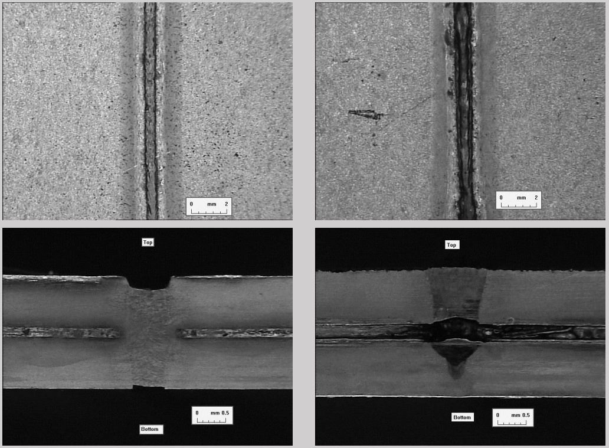
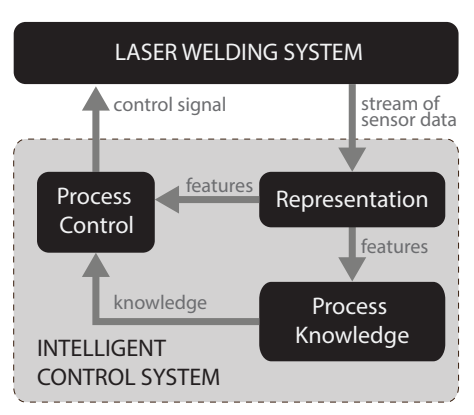
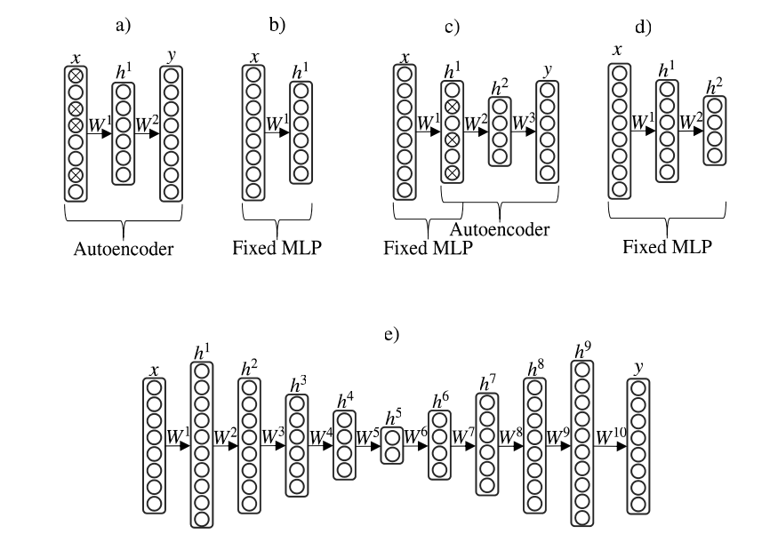
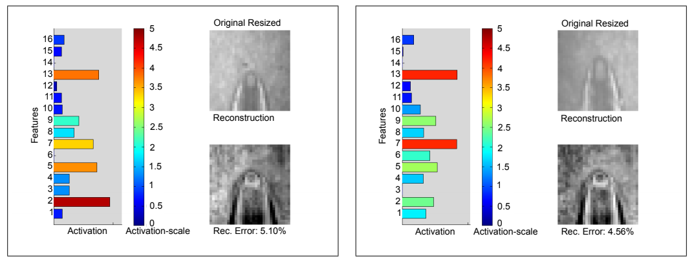
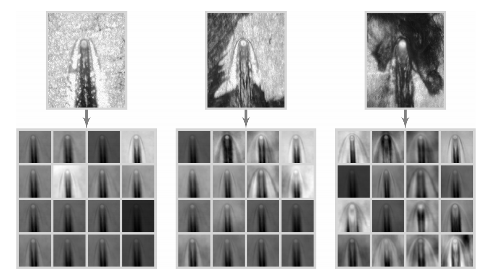
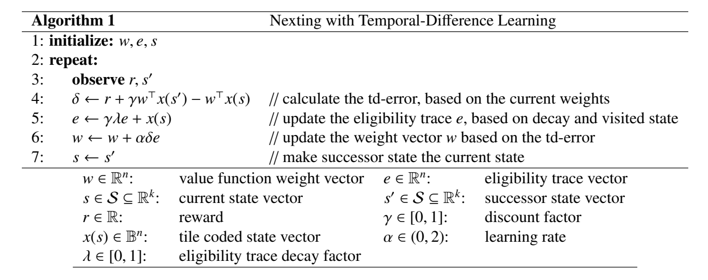
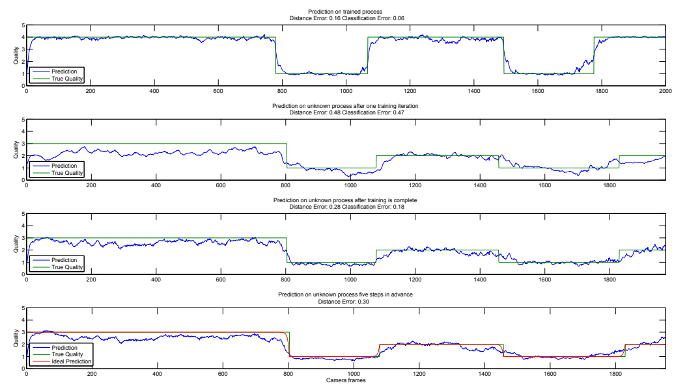
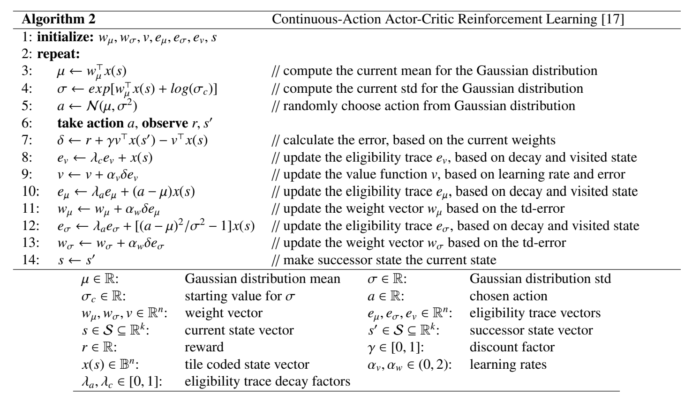
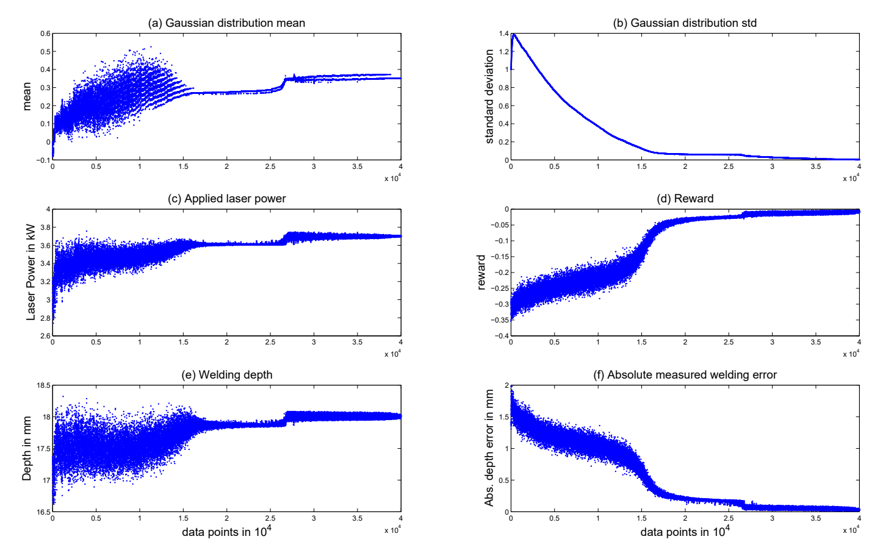

# 基于深度学习和强化学习的通过表示、预测和控制学习进行智能激光焊接体系

## 摘要

激光焊接是一种广泛使用但却复杂的工业过程。在本工作中，我们建议使用一种集成的机器智能化学习体系来辅助解决重要的控制难题，以防止激光焊接在工艺设计和生产中用尽其全部潜力。该体系结合三个现代的机器学习技术，允许激光焊接控制器以自我学习的方式来学习和优化。作为该工作的第一项贡献，我们展示了一个深度自编码器神经网络是如何实现从真实的高维激光焊缝数据提取出明显的低维特征。第二项贡献是一些新颖的集成步骤，这些提取好的特征随后被用于时间差分算法（其实是一个一般价值函数学习器）的输入，以获得关于激光焊接过程的重要实时信息；时间扩展预测与深度学习的结合使用，可以直接将传感器数据映射到焊缝的最终质量。第三个贡献，也是我们提出的体系的最后一个部分，我们提出将深度学习得到的特征和一般价值函数预测与 Actor-Critic 强化学习算法相结合，以学习上下文相关控制策略来实时控制焊接功率，并使用激光焊接模拟器进行了多次初步控制演示。我们提出的智能激光焊接体系结合了表示、预测和控制学习这智能系统的三个主要标志。因此，我们希望像本工作所述的这个集成方法能够不需要持续且耗时的人工协助就可以提高激光焊缝性能。因此，我们的体系有望满足现代工业的几个关键需求。据我们所知，该体系是深度学习与一般价值函数结合的首次演示。它也代表了深度学习明确地在激光焊接与生产工程的首次使用。我们认为，该体系可以很容易地调整以迁移到其它的工业和生产工程环境。

关键词：深度学习 强化学习 预测 控制 激光焊缝

## 1 介绍

激光焊接是一个准确并且快速的焊接技术，在工业焊接系统中得到了广泛的应用。不幸的是，激光焊接往往是一个难以控制的复杂过程。为了解决控制难题，最近研究表明认知激光焊接系统在配置好的且轮廓清晰的工件上表现良好。但是，认知控制仍然处于早期发展阶段，为了满足现代工业的需求，系统必须具备在没有进行繁琐且耗时的手动配置的条件下就能够灵活应对不断变化的环境的能力。

为了满足配置快速与焊接系统灵活的需求，我们提出一个自学习与自优化的激光焊接系统的构想，该系统能够在变化的环境下很好地工作。由于处理过程的动态性与不确定性，经典的基于模型方法并不可行，因此我们建议使用机器学习技术。我们提出的方法集合了一些现代机器学习技术，包括用于状态生成表示的深度学习神经网络和最先进的强化学习预测与控制算法。这些算法使得系统能够在焊接过程中发挥智能的重要作用，也即感知、预测和交互作用。

*表示*：由于激光焊接系统的传感器信号是多维和多模态的，直接使用它们作为实时控制系统学习算法的输入通常是不现实的。基于公认的降维思想，我们使用一个表示学习（预测）算法来将原始传感器数据转换为系统状态的低维且具有形变不变性的表示形式。也就是说系统学会将其输入进行抽象化。特别地，有一种名为深度学习的技术能够在特征提取的各种问题中获得最低的分类错误。此外，深度自编码器已经能够与最前沿的特征提取技术（诸如主成分分析、线性分类分析方法）相竞争甚至超越它们，也可以使得强化学习部分直接从高维的图片数据中学习相关策略。堆叠自编码器已经显示出了实现一般表示的能力，因此对于动态数据与过拟合问题有着更强的鲁棒性。

*预测*：工业中一个非常普遍的问题是无法直接测量过程质量。现在有几种解决此问题的方法，比如系统模型、包络曲线或者查找表。但是这些技术在适用性（先验模型）、准确性（包络曲线）、可伸缩性（查找表）以及适应变化的能力这几个方面有着很大的限制。为了解决这些问题，我们将关于过程质量和状态的智能预测作为我们体系中的重要组成部分。重要的是，我们希望在系统运行期间应当能够学习与调整预测行为。长期以来，预测学习一直被线性模型所支配，但是这些模型难以应用于非线性问题和时变问题。而最新的研究使用时间差分（TD）强化学习算法攻克了这些问题。该技术扩展了经典的时间差分学习，可以允许更加一般的在线预测。我们提出的体系中结合了一种被称为 Nexting 的时间扩展预测方法与一般价值函数，该方法能够学习并在多个时间尺度上进行实时预测。

*控制*：工业应用上存在许多不同控制器，例如 PID 控制器、自适应控制器和模糊控制器。如果能够给出正确且可访问的质量测量结果，则可以很容易地将这些技术应用于激光焊接。但是所有这些方法都需要耗时且需要人工辅助的设置过程，且不适用于不断变化的条件。为了使我们体系能够独自提供高质量的焊缝，必须有一个能够从经验中学习且提升自身性能的控制器。因此，我们建议使用一种机器学习算法，其名为 Actor-Critic 强化学习（ACRL）算法。这类算法包含两部分：Actor 和 Critic。Actor 根据它学到的策略选取一个行为，而 Critic 会评估这些行为。Actor-Critic 算法拥有几个特点对我们特定的控制问题非常有效。由于 ACRL 算法是基于参数的，这些计算能够增量（线性）完成，而且能够在几毫秒内更新。由于从算法中学到的经验不需要使用额外的空间来存储，因此内存空间的需求不会随着时间所增加。该方法通过使用函数逼近，能够很好地解决实际问题，这已经在很多应用中得到了证实。

我们所提出的用于在激光焊接中集成表示、预测和控制的体系结构，有望解决多种与焊接过程的校准和优化有关的关键行业需求。 本文其余部分所述内容如下：第二节描述了激光焊接系统及其监控系统，以及算法如何在我们所提出的体系下进行协同工作。第三节主要集中在深度学习方面，展示自编码器是如何将已有的传感器输入转换为特征的。这些特征将作为强化学习算法的输入，在第四节进行了解释与评估。其结果在第五节进行了讨论，然后在第六节进行了总结。

> 图 1. 镀锌钢激光焊缝及其相应的横截面。左侧是高质量的激光焊接图片，而右侧的焊接是失败的。上侧两张图的区别可以通过激光焊缝的光滑度来区分。在横截面图中可以清楚地看到右侧图片中的激光焊接不充分，两块板之间没有连接。

## 2 激光焊接与建议的体系

### 2.1 激光焊接工艺及其监控

尽管激光焊缝在工业应用中十分普遍，但是仍然有必要密切且一致地监视和控制该过程。工艺不仅会受到诸如温度、湿度或焊接气体质量变化等等的环境不确定性的影响，材料本身也会带来不确定性。这包括但不限于化合物混合带来的变化以及表面厚度带来的影响与污染问题。图一说明了具有不同质量的激光焊缝的示例。

我们参考了激光焊接应用中的常用配置，利用摄像头和光电二极管完成过程。由于锁孔（激光轰击材料的位置）以 500Hz 的典型频率振动，因此所有传感器必须至少以该频率的两倍进行采样。这可以视为该过程的基准功能。摄像头能够以高达 1500Hz 的频率采样，并能以 144x176 像素分辨率提供了有关锁孔几何参数的重要信息。另外，该过程由三个光电传感器所监测，它们分别对应于不同的波长且以 40kHz 进行采样。其中，第一个二极管在 1100nm-1800nm 的波长范围内监测过程的温度，第二个在 400nm-600nm 的波长范围内监测等离子体的辐射，第三个在 1050nm-1080nm 的波长范围内二极管记录激光的反射。

> 图 2. 我们提出的智能激光焊接体系。该体系由三个部分组成：表示、过程认识（预测）和过程控制。第一部分从传感器数据中提取了有意义的低维特征。第二部分使用这些特征学习过程并形成认识。这些认识与特征一起用于控制第三部分中的过程。

### 2.2 体系结构

激光焊接是一个动态的过程，不确定性很高，因此在经典的控制方法下，建立精确的过程模型几乎是不可行的。因此，我们提出了一种机器学习方法。我们提出的体系结构将深度神经网络（DNN）与强化学习算法结合在一起。图 2 展示了我们的体系结构，它由三部分组成：表示、过程认识（预测）和过程控制。在第一部分（基于深度学习的表示提取）用于监测的传感器数据经过处理并转换为信息量较小的特征，以确保实时能力和鲁棒性。这样系统能仅通过提供的传感器数据来检测其当前状态，因此能更好地抵抗环境变化。在第二部分（预测）中使用时间扩展预测，系统可以评估其当前的性能并预测其行为将来可能如何影响其性能。第三部分（过程控制）中，来自表示的特征和来自第二部分的认识组合在一起，进而根据施加到焊接表面的激光功率来控制系统。

## 3 深度学习

我们的表示方法采用了深度学习技术，该技术受到了哺乳动物视觉破层结构的启发。视觉皮层是以分层方式构建的——在第一个表示层中，先检测出简单的边缘，然后逐步将其合并为更高层中的更多抽象特征，从而实现鲁棒的表示。基于这个概念，我们创建了具有多层非线性的人工神经网络。然而，增加了太多的层会导致更复杂和非凸的优化问题，这可能导致这种方法比浅层神经网络的性能更差。我们已经通过贪婪的逐层预训练克服了这个问题，该方法是首先对每一层进行单独训练（预训练），然后对整个神经网络进行精细调整。

本体系中的各层神经元数量递减，因此该学习技术不仅可以用于为给定的数据机生成有意义的表示形式，还可以用于压缩。为了创建压缩特征，神经网络必须减少中间层神经元数量。这种结构称为自编码器，其最简单的形式包括三层，即输入层、隐藏表示层和输出层。我们假设在输入和输出层均有 p 个神经元，在隐藏层中有 q 个神经元。设 $f$ 为 $\R \to \R$ 的激活函数（比如 $Sigmoid$ 函数），其中输入层的向量 $x \in \R^p$。通过下式可计算得隐藏层中第 $i$ 个神经元的值

$$
h_i(x) := f(w_i^T x + b_i), for\ all\ i = 1, \cdots , q,
$$

其中 $w_i \in \R^p$ ，表示与第 $i$ 个神经元相关的加权系数，而 $b_i \in \R$ 是对应的偏置。在计算隐藏层神经元的值之后，隐藏表示将用作解码（输出）层的输入。设隐藏层的表示向量如下

$$
h := [h_1(x), h_2(x), \cdots , h_q(x)]^T \in \R^q
$$

在输出层的计算如下

$$
y_j(h) := f'({w_j'}^T h + b_j'), for\ all\ j = 1, \cdots, p
$$

其中 $w_j' \in \R^q$ 与 $b_j' \in \R$ 为与第 $j$ 个输出层神经元的链接权重。设 $W := [w_1, \cdots , w_q] \in \R^{p \times q}$ 且 $W' := [w_1', \cdots, w_p] \in \R^{q \times p}$。值得注意的是，激活函数 $f'$ 不需要与 $f$ 相同，如果解码器权重 $W'$ 与编码器权重 $W$ 相关联（即 $W' = W^T$），则自编码器的工作方式与受限玻尔兹曼机相媲美。

我们用原始输入向量 $x$ 与重构后的 $y := [y_1(h), \cdots , y_p(h)]^T \in \R^p$ 之间的误差来衡量一个隐藏层表示 $h$ 质量，并将其用于反向传播算法。对于实数值的输入（例如图像），均方误差（MSE）是最常见的选择，其损失函数形式如下

$$
L(x, y, W, W') = \frac{1}{2}||x - y||_2^2 + \frac{\lambda_1}{2} ||W||_F^2 + \frac{\lambda_2}{2} ||W'||_F^2
$$

其中 $||\cdot||$ 指矩阵的 Frobenius 范数。这里的损失函数由残差（重构）误差项和正则项（又称权重衰减项）两部分组成。权重衰减参数 $\lambda_i > 0$ 用于控制各层权重大小，以防止自编码器过拟合。

为了将传统的自编码器原理扩展到深度学习，我们如图 3 所示将自编码器彼此堆叠。在这种设置下，第一个编码器的隐藏表示用作下一个编码器的输入，以此类推。这种从表示创建表示的方法，类似于深度置信网络（DBN）。基于贪婪的分层预训练的思想，首先训练传统的一步式自编码器。在其收敛之后，固定其中的编码器权重，然后堆叠下一步的自编码器（如图 3 所示）。以此类推，直到完成整个结构。在此过程中整个堆叠式自编码器会不断微调。

在逐层贪婪预训练时，每个自编码器输入都额外增加一个高斯白噪声的干扰项，其采样自均值为 $\mu$、标准差为 $\sigma$ 的高斯分布（$N(\mu, \sigma^2)$）。选择了 $\mu = 0$ 的高斯白噪声是因为它对应于照相机和光电二极管中出现的有噪声的传感器读数。相关研究已经证明，尝试从受到干扰的输入中重建未受干扰的图像会得到更有意义的表示。如表 1 所示，噪声的均值为 0，对于第一个自编码器，其标准差为 $\sigma = 0.5$，随后几层应逐层选取适合该层的标准差，注意选取的值应当避免干扰所带来的异常激活现象。标准差的选取是通过计算各层激活值 $\sigma^k$ 的标准差来完成的（其中 $k$ 表示层序），并将其降低为采样噪声的激活的 10%。在每一层，有 50% 的输入神经元被噪声所干扰。更多有关堆叠降噪自编码器的介绍可参见 [10]。

我们选择了部分线性函数作为编码器的激活函数，该函数比典型的 logistic 或者 tanh 激活函数具有更加理想的属性。使用此激活函数的单元被称为修正线性单元（ReLU）。ReLU 激活函数的定义如下

$$
f(x) = max(x,0)
$$

因此，对于随机初始化的权重，隐藏层中大致上有 50% 的单元是处于未激活状态。因此，与其它单元相比，ReLU 学会了稀疏表示。此外，ReLU 可以从两个方面进行更快的训练：它们不需要进行迭代就可以进行，并且在大多数 CPU 上其激活功能的执行要快得多。我们建议实数输入的解码器使用非挤压激活函数。学习率的选择对结果的收敛性和准确性具有至关重要的影响。在预训练和精细调整的一半迭代之后，降低学习率并线性增加动量（Momentum），如 [35, 36] 所述。

> 图 3. 堆叠式降噪自编码器。(a) 仅具有一个隐藏层的自编码器学习从受干扰的输入到输出的映射。(b) 一旦学习收敛，就将其权重固定。(c) 将新的较小的层堆叠在第一层之后，在这些隐含层再次加入噪声干扰。(d) 收敛后，固定第一层和第二层隐层的学习权重。(e) 本实验中使用的最终体系结构。表 1 中描述了每层中使用的实际神经元数量。

|参数|值|
|-|-|
|每层所包含的神经元数量（编码器以及瓶颈层）|1024-2048-1024-512-256-16|
|衰减的学习率|0.0005-0.00025|
|Momentum 系数|0.005-1|
|L1 正则化因子|0.00005|
|Mini-batch 大小|预训练：100，微调：200|
|第 1 层高斯噪声干扰分布|$N(0, 0.5)$|
|第 2-4 层高斯噪声干扰分布|$N(0, 0.1\sigma^k)$|
|噪声干扰率|50%|

表 1. 深度自编码器参数

为了进一步加快训练速度，我们将 Mini-Batch 随机梯度下降（MB-SGD）应用于预训练和精细调整。MB-SGD 是批量梯度下降（BGD）与随机梯度下降（SGD）的一个折衷方案，因此，当 mini-batch 大小为最佳时，MB-SGD 最快。为了更快的收敛和更低误差，我们将经典的 Momentum 优化方法应用在 MG-SGD。训练过程收敛时，便可以去掉解码层（也即瓶颈层之后的所有层）。图 3 e) 中的 $h^5$ 表示了自编码器使用最少数量的隐藏表示。瓶颈层的隐藏表示可以用作低维表示或特征，如图 2 所示。

为了测试上述 DNN 方法的性能，我们对来自不同过程的 16000 激光焊接图像进行了实验，并将其分成四组相等大小的数据集。这些数据集用于四重交叉验证。我们对每个图像进行感兴趣区域（ROI）提取，并将该部分二次采样为 32x32 的大小。对于瓶颈层隐藏表示数量 $q$，我们分别选取了 4, 8, 16, 32, 64 进行了实验，其中使用 16 个特征所产生的误差最小。深度自编码器从 8 个不同的测试数据集的 16 维特征中获得了 16.6% 的重建误差平均值。与平均重建误差为 15.5% 的主成分分析（PCA）相比，深度自编码器是一种有竞争力的选择。当作为两个支持向量机（SVM）分类器的输入以区分干净的焊缝和污染的焊缝时，深层自编码器所提取的特征也产生了较低的分类错误（见表 2）。

|分类误差|PCA|深度自编码器|
|-|-|-|
|SVM RBF kernel （4 特征）|$4.93\% \pm 0.27\%$|$5.54\% \pm 0.51\%$|
|SVM RBF kernel （8 特征）|**$1.66\% \pm 0.17\%$**|$1.39\% \pm 0.16\%$|
|SVM RBF kernel （16 特征）|$1.79\% \pm 0.19\%$|**$0.81\% \pm 0.11\%$**|
|SVM RBF kernel （32 特征）|$5.68\% \pm 0.23\%$|$2.07\% \pm 0.10\%$|
|SVM RBF kernel （64 特征）|不收敛|$5.43\% \pm 0.33\%$|

表 2. 使用 PCA 和深度自编码器分别提取出一定数量的特征，将其作为 SVM 的输入进行分类错误的比较。两种方法的最佳分类结果以粗体标出。

> 图 4. 神经网络对不同输入的反应。该图显示了两个不同过程的原始图像（经过预处理）、重建图像以及激活程度颜色编码图。误差是原始图像与重建图像之间的 MSE。

表示的目的是提取有意义的压缩特征，以便能够区分不同的状态（例如干净的焊缝或损坏的焊缝）。图 4 展示了神经网络对不同图像的反应。可以看出，激活程度在变化并且神经网络能够据此区分图像所呈现的不同状态。如图 4 所示，瓶颈层中的激活范围没有任何限制，仅取决于层号。由于使用了激活函数并进行稀疏表示，每添加一层激活的幅度将会越小。

为了进一步已经训练好的 DNN，我们以特定的方式可视化其特征：除一个特征外，其余所有特征均设置为 0。并根据其它特征的激活值对解码器的输出结果进行缩放。使用此方法，我们生成的图像将特定功能的激活区域标记为明亮的部分。每个特征都重复此步骤。该过程输出的可视化效果可以在图 5 中找到。

> 图 5. DNN 特征可视化图像及其对应的原始图像。原始图像中的黑点是由于油的污染。为了提高可见度，对图像进行了亮度滤波。每张输入图像将重建 16 张特征图像，这些特征图像显示了图像的特化和激活。可以看出，不只是激活程度，各个特征的特化程度都取决于输入图像。不同的特征分别专门针对输入图像的不同方面。

## 4 强化学习

强化学习（RL）是机器学习和人工智能的一个分支，专注于目标导向的学习和决策。在 RL 问题中，学习的目的或目标是根据称为奖励的单个标量信号来指定的，该标量信号可用于衡量成功或失败。因此，解决 RL 问题的方法并不像在监督学习的相关领域中那样在学习过程中显式依赖有标签的训练数据，RL 的解决方法是通过反复试验来学习的。在与问题或环境的持续互动中，强化学习智能体采取行动并观察所得的奖励。然后，智能体根据这些观察结果来改变其选择动作的方式。换句话说，RL 的解决方案使用状态评估和状态-行为数据对来改变将状态映射到可选择行为的方式，此映射称为策略。由于策略的改变是由结果的最大化所驱动的，而不是对简单的数据对进行拟合，因此 RL 不一定要求设计者为每个新的学习场景提供全面的领域信息。RL 可以考虑整个问题，而无需明确划分和优化子问题。由于这种通用性，并且因为 RL 主要关注从不断积累的经验中学习，所以它非常适合于变化的环境和变化的条件。RL 不可或缺的是从经验样本中学习对未来观察的期望（预测学习），并使用经验样本来影响策略变化（控制学习）。

通常，RL 问题可以作为一个马尔可夫决策过程（MDP），其中智能体的行动选择部分决定了智能体在一系列环境情形（state）中的进步，以及由于行为的发生导致从一个状态过渡到另一个状态所得到的奖励。在形式上，MDP 可以由四元组 $\mathcal{S}, \mathcal{A}, \mathcal{P}, \mathcal{R}$ 定义，其中 $\mathcal{S}$ 表示状态集合，$\mathcal{A}$ 表示所允许的行为集合，$\mathcal{P}: \mathcal{S} \times \mathcal{A} \times \mathcal{S} \to [0, 1]$ 表示状态之间的转换概率，最后 $\mathcal{R}: \mathcal{S} \times \mathcal{A} \times \mathcal{S} \to \R$ 为该过程所产生的奖励。在每个时间步 $t$（$t \in \{0, \cdots , T \}$），智能体都遵循策略 $\pi: \mathcal{S} \to \mathcal{A}$ 在处于状态 $s' \in \mathcal{S}$ 时选择对应的行为 $a \in \mathcal{A}$ 。之后，系统将根据 $\mathcal{P}$ 和 $\mathcal{R}$ 给出的变换概率以及奖励来生成下一个状态 $s' \in \mathcal{S}$ 以及奖励值 $r = \mathcal{R}(s, a, s') \in \R$。给定 MDP，RL 系统的目的是使预期的未来奖励总和最大化。该数值称为回报，根据折扣因子 $\gamma \in [0, 1]$ 进行加权，该折扣因子确定学习目标是对短期奖励（$\gamma$ 接近 0）还是对长期奖励（$\gamma$ 接近 1）施加更大的权重。为了使回报最大化，智能体使用每个采样的转换数据来改善值函数，也就是学习一个这样的近似：对所有给定状态 （$V_\pi :\mathcal{S} \to \R$）获得正确的预期回报，或者让状态-动作对 （$Q_\pi : \mathcal{S} \times \mathcal{A} \to \R$）遵循策略 $\pi$。学习到的值函数随后将用于改善策略 $\pi$ 。此迭代过程称为 *广义策略迭代*，这也是 RL 的标志。其中，$\pi$（控制策略）和 $V_\pi$ （对所有状态的预期未来回报的预测）表示着通过 RL 方法学习的输出，换言之，也就是解决方案。

为了用 RL 算法表示连续状态空间，就像在许多实际问题中一样，需要对真实环境进行近似。Tile Coding 是一种非常适合在线实现的近似技术，它能够将连续变量转换成稀疏的二进制表示形式。我们采用了 Sutton 和 Barton 描述的标准 Tile Coding 方法，即给定一个函数 $x: \mathcal{S} \to \mathbb{B}^n$，它将一个 $g$ 维列向量 $s \in \mathcal{S} \subseteq \R^\mathcal{g}$，映射到 $n$ 维二值列向量 $x(s)$ 。我们可以使用通过学习得到 $n$ 维列向量 $w$ ，进一步地，由于给定任何状态时内积 $w^T x(s)$ 都表示了该情况下的回报，我们便可由此来近似 $V_\pi$。

### 4.1 预测

为了可靠地控制焊接过程，必须能够获取到可以充分表示系统当前性能的信息。由于在激光焊接过程中不能直接获得这种性能指标，因此，我们现在介绍一种称为 Nexting 的特定 RL 算法以及我们对其的实现过程，以估计过程控制的的有效性。Nexting 是源自心理学的术语，它是对接下来会发生什么的短期预测。正如 Modayil 等人所证明的，Nexting 也在计算预测问题中有着应用，并专门提出了一种利用 RL 中众所周知的技术来估算各种实时信号的方法。尤其是，Nexting 利用具有线性函数逼近和通用值函数的 TD 学习，因此能够对多个时间尺度上的任意非奖励或奖励信号做出预测。按照 Pilarski、Dick 和 Sutton 所描述的方法，在表 3 中介绍了我们用于过程质量的 Nexting TD 学习算法。为此，我们分别评估了 $\gamma = 0$ 和 $\gamma = 0.8$ 这两个折扣因子。当 $\gamma = 0$ 时，该算法以类似于使用最小均方更新的增量监督学习方式预测即时伪奖励，即当前的质量。而 $\gamma = 0.8$ 时的所做的选择会产生更为远见的预测。我们设置迹衰减参数 $\lambda = 0.9$，步长（学习率）为 $\alpha = \frac{1}{m}$，其中 $m$ 是 Tile Coding 的特征表示 $x(s)$ 中活动 Tile 的数量。权重和迹向量均为 $n = 10001$ 维的列向量，并使用 0 进行初始化。

为了向智能体提供输入，我们进行了不同的激光焊接过程并记录了所得的传感器数据。这些焊缝之后由专家进行了评估并加了标签，也即，对所有过程根据 EN ISO 13919-1:1996 标准按其质量进行分类。标签范围从 1 到 4，其中 1 表示不充分的激光焊接，而 4 表示理想的激光焊接，在 EN ISO 13919-1:1996 中用 B 表示。标签 2 和 3 分别对应于类别 D 和 C。这些专家得出的质量度量将用作后续 Nexting 算法要预测的信号（即伪奖励信号 $r$ ），进而代入表 3 第 4 行公式用于 TD 更新。该算法根据权重向量 $w$ 与当前状态（即传感器数据 $s$）预测一个奖励值 $w^T x(s)$。然后将此值 $w^T x(s)$ 与实际的质量 $r$ 和下一个状态的折扣预测值进行比较，以计算标量 TD 误差 $\delta$ （第 4 行）。然后更新权重以降低 TD 误差，改善算法的预测，以使算法接近 TD 收敛点 $r + \gamma w^T x(s') = w^T x(s)$。对于数据集中的每个时间步，此更新都是按顺序进行的。作为该训练过程的结果，权重向量 $w$ 成为标签数据背后的特征与质量之间关系的一种总结性认识。学习之后的权重可以应用于其他过程的预测。为了与标签数据的过程质量值进行视觉比较，可以根据折扣率对学习的回报 $w^T x(s)$ 进行 $\gamma$ 归一化，也即 $(1 - \gamma) w^T x(s)$。

> 表 3. 用于激光焊接工艺质量预测的 Nexting 算法。

> 图 6. Nexting 算法的学习过程。该过程的实验对象是有污染的镀锌钢焊缝。绿线是专家估计的真实的过程质量，而蓝线是算法的预测。第一张图显示了经过训练的过程性能。第二张图显示了训练开始时对未知过程的预测。第三张图是训练完成后对相同位置过程的预测。最后一个图展示了 $\gamma$ 归一化的 TD 时间预测，其中每个预测都提前 5 个时间步。我们计算了理想的 $\gamma$ 归一化预测作为标准，并用红线表示。

该算法对镀锌激光焊接过程进行了训练。将激光设置为适合材料的条件，即功率为 2000W，速度为 3.5m/min。在两个不同的位置，焊缝被油脂污染。污染物会影响焊接质量，因为一旦激光击中油脂，油脂就会开始燃烧。这很可能导致接头不充分，从而导致该区域的焊接质量下降。我们在每个实验中使用两个误差（图 6，见每个图标题下方）评估我们的方案。给定质量标签的等级顺序，首先想到的也是最合适的度量是归一化预测值与真实质量之间的简单的平均绝对误差或者距离误差。为了能够与 $\gamma = 0$ 的监督学习相类比，我们还设计了分类误差，即将预测值四舍五入到最接近的整数以与真实标签进行比较，进而表明算法是否预测出了正确的质量等级。状态 $s$ 是指 DNN 从摄像机图像提取出的 16 个特征以及光电二极管数据组成的 19 维状态向量。我们遵循图 2 所提及的体系，利用 DNN 进行表示学习算法提取特征。图 6 中的前 3 张图说明了该算法学习和生成传感器数据的即时过程质量的能力（$\gamma = 0$）。图 6 中的第一张图说明了通过连续数据时在典型训练中的表现。可以看出，该算法能够学习过程并根据传感器数据正确预测真实质量。

为了展示预测未知过程的能力，我们利用一组过程对算法进行了训练，然后对先前未见过的不同过程进行了评估。图 6 中的第二张图显示了在经过训练数据集的一个训练迭代之后，在测试数据集上的预测性能，这相当于将之前的过程作为起点的在线学习。在只看过一次训练数据之后，该算法已经能够跟随测试数据的趋势，但是性能仍然有限。虽然智能体能够将对过程的可接受部分与有害部分进行区分，但是良好类别与不良类别之间的区分并不清楚，有着 0.48 的距离误差。为了进行比较，继续在训练数据上迭代学习，直到收敛为止，并再次遍历测试数据以测试。结果显示在图 6 的第三张图中。通过增加训练，该算法能够清楚地区分可接受的部分和不良部分，并且距离误差已降至 0.28。[^footnote]

提供对某一时刻的质量度量是很有用的特性，而 TD 学习方法（例如 Nexting 算法）就是一种可以学习在增量时间内所对应的质量的算法，这使得它可以学习到预测在未来某一时间段内的性能，这是该算法与常规监督学习相比的优势。该预测可能很重要，因为它可以使得我们在观测到未来之前就能够提前预知，并据此更改参数。图 6 的最后一张图说明了时间扩展预测的效果。该算法经过训练，可以在约为 5 帧（$\gamma = 0.8$，相当于 0.1ms）的折扣窗口上预测过程的行为。如图所示，尽管 $\gamma$ 归一化后的距离误差略微增加到了 0.3，但该系统能够学习焊接过程的时间抽象预测。由于对于 $\gamma > 0$，分类错误并没有明确的语义，所以这里没有显示。

### 4.2 控制

为了解决激光焊接中连续行为空间是固有的这个问题，我们选择了一种针对连续行为的 Actor-Critic 强化学习（ACRL）算法，该方法由 Pilarskietal 所描述，使用了一维行为空间。表 4 描述了该算法，并使用与表 3 中的 Nexting 算法相同的约定和符号。对于该初步控制实验，我们使用了模拟焊接工艺，具体描述如下。使用激光焊接宽度作为当前状态的表示，并将其提供给算法；智能体输出的行为作用于控制时所施加的激光功率，该功率是在 1 到 5 之间的实数。Actor 遵循随机控制策略 $\pi(a | s)$ ，该策略是从均值为 $\mu$ 标准差为 $\sigma$ 的高斯分布 $N(\mu, \sigma^2)$ 采样的，它对应于学习得到的权重向量以及特征向量的组合，如表 4 中第 3、4 行所示。然后将动作映射到焊接系统的功率，超出范围的进行裁剪处理，以使施加的功率不能大于系统的极限。学习的标准差是探索算法的一种度量。如果 $\sigma$ 大，则该算法更有可能探索不同的动作。由于探索这一步骤通常会导致性能不佳，为了找到正确的均值以获得稳定且良好的性能，标准差必须降低。在完全集成系统中，提供给控制学习过程的奖励是对焊缝完整性的度量，即上一节中所述的焊接质量预测，这可以通过 Nexting 学习算法获得。然而，为了在模拟器中快速测试方法的可行性，我们为智能体提供了一个奖励信号，该奖励信号对应于达到的焊接深度 $d$ 与目标深度 $d^*$ 之间的差。为了使奖励值有界并防止可能的差异导致过大的 TD 误差，该奖励函数基于 Sigmoid 函数，设计为 $r = -0.5 + 1/[1 + exp(|d^* - d|)]$。其值域为 $[-0.5, 0]$，其中值 0 对应了焊接刚好处于正确的深度。

在 Actor-Critic 学习算法中，Actor 会学习一个策略来生成行为，而 Critic 会评估算法的性能，以降低对学习算法更新时的方差。Critic 对于每个采样的四元组 $(s, a, r, s')$ 计算 TD 误差，并使用它来更新值函数 $v$ 以及用于计算 $\mu$ 和 $\sigma$ 的权重。对于我们的实验，我们使用以下学习参数：学习率 $\alpha_v = \frac{0.1}{m}$、$\alpha_w = \frac{0.1}{m}$，折扣因子 $\gamma = 0.99$，迹衰减参数 $\lambda_a = 0.3$、 $\lambda_c = 0.3$，$\sigma$ 初始值 $\sigma_c = 1$，其中 $m$ 是活动的 Tile 数量。所有的迹以及 Actor 的权重使用 0 初始化。算法以较佳的方式进行初始化，这意味着权重向量 $v$ 在学习开始时拥有一个对于所有状态的理想值，也就是 0。

对于初始过程控制的结果，该控制算法在初步的模拟器上进行了测试，该模拟器根据焊缝宽度提供焊缝深度，焊接深度范围为 10mm 至 20mm，焊缝宽度为 1.2mm 至 4.4mm。激光额定功率范围为 1.5kW 至 5kW。为了使模拟器设计得更接近真实的激光焊接系统，在征询了激光焊接专家的意见后进行了后续更改。为了模拟传感器噪声，对焊缝宽度也即系统状态添加标准差 $\sigma = 0.05$ 的高斯白噪声。由于实际的激光焊接系统只能以一定的速率更改其激光功率，因此模拟器的更改限制在 200W 之内。最后，由于实际系统具有物理响应时间，因此焊接受到限制，以至于每次迭代最多只能改变 0.3mm。这相当于焊缝宽度所允许的总范围的 10%。

> 表 4. 具有连续值输出行为的 Actor-Critic 算法，用于控制激光焊接功率

我们使用模拟器进行了 30 次独立的学习过程并取平均值。图 7 显示了整个学习过程中几个根据 Actor-Critic 算法的参数得出的结果。学习过程刚开始时，算法会从正态分布中随机选择行为（即所施加的激光功率）。智能体会根据得到的奖励，将学习到的 $\mu$ 值移向正确的行为，并减小 $\sigma$ 以减少探索步骤，以使学习的过程收敛到合适的目标策略。进一步我们可以看到，深度误差和观察到的奖励值都接近于 0，也就是说，通过不断学习，该系统能够精确达到所需的焊接深度。尽管该算法已经对处理包含噪声的过程和相关限制进行了应对，但它的精度仍然受到噪声级别的影响。实验没有发生偏离，这进一步表明了该算法的鲁棒性。

> 图 7. 连续的 Actor-Critic 算法在 30 次独立运行中的平均学习效果。最上面的两张图 (a), (b) 显示了高斯分布的学习参数，其输出动作显示在图 (c) 中。曲线 (d) 显示了如何随着时间推移根据奖励执行算法。图 (e) 和 (f) 的曲线显示了所达到的焊接深度和至所需焊接深度的距离。

## 5 探讨

在本文中，我们提出了一种新的体系结构，该体系结构应能够学习和控制各种特定的激光焊接问题。在此体系结构中，使用表示学习直接从焊接过程数据中获取显著特征。这些学习到的表示作为输入直接给预测智能体，因此系统能够估计有关焊接过程的缺失信息（也就是焊接过程中无法直接测量的焊缝质量信息）。最后，我们描述了特征和质量相关的认识是如何可以潜在地传递给集成系统的控制智能体，并根据新的状态和工作环境来优化激光焊接的效果。尽管我们提出的体系足够灵活，可以处理过程中的各种问题，但本工作中所使用的表示和认识框架已经用于处理一种特定的感兴趣的激光焊接过程。由于相关新过程的重新定义，我们的体系结构得以扩展，我们希望当前的结果能够很好地转移到不同的环境中。此外，尽管这项工作中后续预测的目标只是过程的质量，但原则上，任何与过程相关的信号或者信号组都可以使用一般价值函数进行预测，并用于告知下游控制过程或控制智能体。我们提出的体系结构提供了一种在控制学习中更加通用的预测状态的表示的方法。

*表示*：在第 3 节中，我们证明了 DNN 能够在激光焊接环境中提取有意义的特征，然后将其用于表示当前过程状态以集成到认识和控制过程中。通过 SVM 分类器进行的测试表明，DNN 生成的特征比 PCA 生成的特征的表现更好。

*预测*：认识过程证明了其了解焊接过程行为的能力，不仅可以重现所学信息，还可以预测未知过程，图 6 展示了质量分类，准确度为 82%。如果仅用于区分焊缝的良好和不充分两者，则预测器的准确率达到了 93.1%。如图 6 的底部图所示，通过进行时间扩展的预测，可以预测过程中的行为，并且可以在质量发生改变之前预防地应用一些控制相关措施。预测的计算在 21$\mu s$ 内完成，这在实时操作的要求之内。

*控制*：第 4.2 节中描述的控制算法在较短时间内可以收敛到正确的解决方案。即使受限于含噪声的输入和缓慢的系统响应等问题，Actor-Critic 方法总能收敛到正确的解决方案。就计算而言，它也足够快。整个模拟时间为 66.3s，其中 52.6s 用于激光焊接系统。因此，单个控制迭代仅花费 0.34ms，这满足过程要求的实时能力（1ms）。用于实验的计算机使用了 Intel Core i5-2400，时钟频率为 3.1GHz，三级共享缓存为 6MB，内存为 DDR3 接口、大小 4GB，系统为 64 位 Windows7。模拟器的实现适用于以下假设：该算法能够提供有关系统状态的有意义的特征，并且预测过程可以准确地预测当前性能。另外，如果要在工业环境下应用，则需要一个完全集成的框架，其中，在焊接过程中，将学习到的 DNN 提取出来的特征和后续预测直接用作 ACRL 控制智能体的输入。

## 6 结论

在本文中，我们展示了一种新的可行的激光焊接体系结构。我们提出的系统包括过程观察、建立关于过程的知识以及找到控制过程的方法这三个问题的方法。该系统可以优化自身性能，这是由于其以目标而不是机制对过程进行优化的。因此，我们这一结合了能够快速学习且可以在不断变化的环境中良好运行的架构有望满足现代工业的关键需求。

在本工作中，我们描述了较新的强化学习和深度学习算法的一种可能组合，并提供了对该组合可能对激光焊接技术产生影响的见解。据我们所知，这是深度学习与 Nexting 算法以及一般价值函数的首次组合，也是描述强化学习和深度学习系统相结合的极少数论文，例如 [8, 9]。此外，这是深度学习在激光焊接和工业生产过程中的首次展示。这项研究在使用强化学习获得广义预测以用作激光焊接系统的输入方面也很独特。这使得该工作不仅对工业过程，而且对智能系统和机器智能的研究都做出了重要贡献。但是，我们不希望我们的方法仅局限于本工作中所部署的确切学习方法。本文的另一个重要贡献是建议将表示、预测和控制学习完全集成到单个框架中，这对激光焊接和其他生产工程领域有着广阔的前景。我们坚信我们的方法可以转移到广泛的工业应用中。

## 鸣谢

CCLW 项目是在欧洲资助计划 Eurostars 的框架内进行的，并由联邦教育和研究部资助。我们还要感谢所有项目合作伙伴，即德国的 Precitec GmbH. & Co. KG 和法国的 IREPA LASER 和 Illkirch，他们提供了激光焊接数据。作者还感谢加拿大阿尔伯塔省机器学习创新中心和加拿大阿尔伯塔省创新技术未来中心、加拿大自然科学与工程研究理事会（NSERC）的支持，并感谢 Richard Sutton 和 Joseph Modayil 进行了许多有益的交流。

## 参考文献

略

[^footnote]: 过程刚开始时的初始误差是由于照相机在打开激光之前就已经开始记录。
