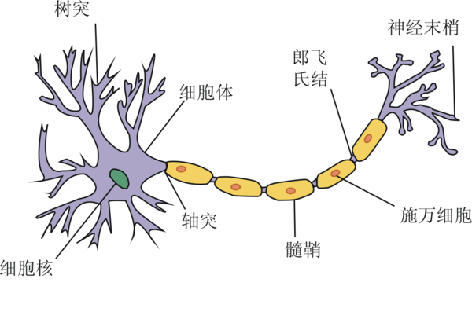
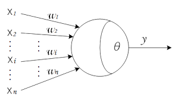
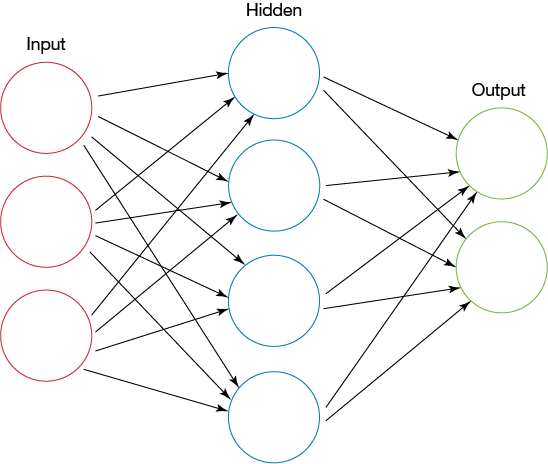
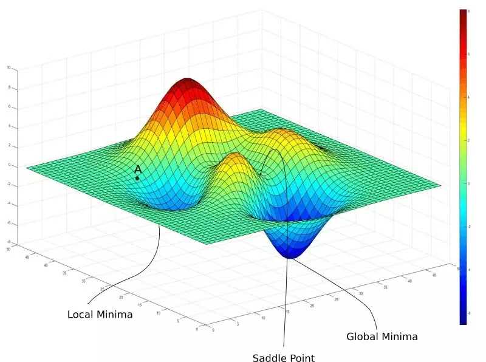
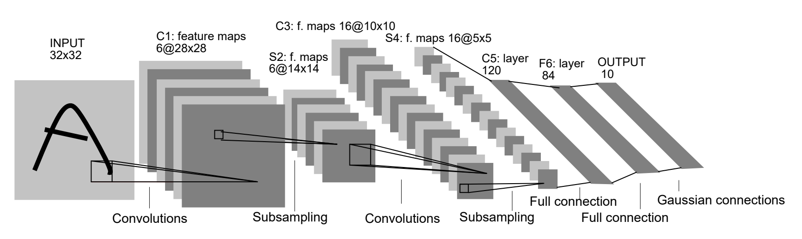
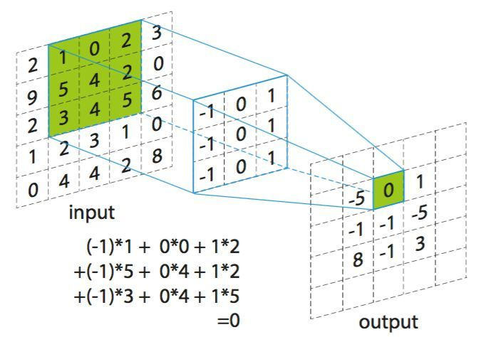
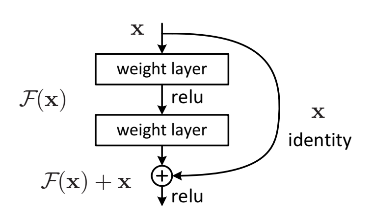

# 文献综述

<!-- 基于神经网络的铝合金焊缝成型的预测研究 -->

## 1.1 研究背景和意义

焊接是一种以加热或加压方式对材料进行接合的工艺及技术。其操作要求严苛，对操作人员有着较高的熟练要求，且工作环境恶劣，操作人员常常处于高危且有毒的环境中，存在着很多的潜在危险[1]。而焊接机器人的应用能大大改善上述问题。它能够提供稳定且均一的焊缝，使得焊缝质量更有保障[2]。同时也改善了操作人员的劳动条件，操作人员只需要装卸工件，就可避免接触有毒的气体和弧光等。另外，由于焊接机器人可以二十四小时连续生产，因此它的生产效率更高。由此可见，智能化与自动化生产已经成为了现代焊接技术发展的必然趋势。

现代焊接机器人主要根据视觉、电弧、力矩等相关传感器获取焊接环境的相关信息，经过智能化控制与调节来优化自身的焊接轨迹，从而完成复杂的焊接任务[3]。然而近年来焊接机器人的应用飞速增长，同时焊接机器人的应用领域也逐渐趋向复杂多变，焊接控制技术迎来了极大的挑战。由于焊接过程充满了强烈的弧光辐射、焊渣的飞溅、灰尘等不确定因素，还有着高温、氧化等等问题[4]，都会对焊接机器人所接收到的传感器数据产生影响，以至于焊接产生偏差，影响焊缝质量。为了使得焊接机器人能够应对这些问题，焊接机器人必须有比较强的抗干扰能力。

焊缝的尺寸能在一定的程度上表征焊缝的质量，宽度均匀且一致的焊缝往往质量也较佳。如果能够通过现有参数来预测焊缝尺寸，也就能提前预知并调整焊缝质量，进而获得优质的焊缝。然而影响焊缝质量的因素众多，难以直接推理出精准的预测公式，往往需要利用机器学习算法对已有数据进行拟合。其中神经网络对非线性模型有着极强的拟合能力，同时也有着极佳的抗干扰性，它能够从焊接参数中提取出鲁棒的表示，进而较为精准地预测出焊缝尺寸。

基于上述分析，本文利用神经网络对焊接过程中传感器采集到的数据与对应的焊缝尺寸进行拟合，并对模型准确率进行评估，以便在焊接过程中获得宽度均匀的焊缝，为后续焊接自动化控制奠定了基础。

## 1.2 神经网络研究现状

神经网络（Neural Network，NN）的相关研究在很早以前就已经出现，而如今已经形成了一个相当大的多学科交叉的学科领域[5]。通常所说的神经网络是指人工神经网络（ANN），是机器学习领域中的一种模仿生物神经网络的结构和功能的数学模型或计算模型[6]。

### 1.2.1 神经网络模型

生物神经网络最基本的单元是生物神经元（neuron）。生物神经元的基本结构如图 1.1 所示，当一个神经元的电位达到一个阈值时，它会转变为“兴奋”状态，进而向下一个神经元传递神经递质，以影响下一个神经元的电位。生物神经元彼此连接形成网状结构，从而能够完成复杂的功能。

图 1.1 生物神经元结构

1943 年，McCulloch 与 Pitts 将上述情形抽象为一个如图 1.2 所示的简单的数学模型，也就是人工神经网络中最经典的 “M-P 神经元模型”。类似于生物神经元的概念，M-P 神经元接收前驱 $n$ 个神经元的输入信号，并对每个信号赋予一定的权重进行加和，得到 $\sum\limits_{i=1}^n w_i x_i$，将其作为该神经元的信号。当该信号值达到阈值 $\theta$ 时向下一个神经元传递信号，也就是向后一神经元传递信号 $y = f(\sum\limits_{i=1}^n w_i x_i - \theta)$。其中 $f$ 为激活函数，这里使用的是阶跃函数，也即 $f(x) = sgn(x)$。然而由于阶跃函数具有不连续、不光滑等问题，实际应用中常使用 $Sigmoid$ 函数作为激活函数。

图 1.2 M-P 神经元结构

类似于生物神经网络，将神经元彼此连接便形成了人工神经网络。单层神经网络只包含一个输入层和一个输出层，由于输入层神经元仅接收外界输入而不对数据进行处理，所以输入层往往不计入层数中。单层神经网络的处理能力有限，很难解决线性不可分的问题，所以常见的神经网络一般是两层以上的。两层的神经网络又称为单隐层神经网络（如图 1.3），它包含了一个输入层（input layer）、一个隐藏层（hidden layer）和一个输出层（output layer）。输入层和输出层分别接收外界输入和将输出传输给外界，隐藏层和输出层都有着数据处理的功能。

图 1.3 单隐层神经网络结构

神经网络的输出结果是与预期输出有一定的误差的，比如对于输入 $x_k$，其预期输出为 $y_k$，而预期输出结果为 $\hat{y}_k$。我们可以使用误差函数对该网络进行评估，比如当误差函数为均方误差（mean squared error）时，总误差值为 $E_k = \frac{1}{2} \sum\limits_{j=1}(\hat{y}_j^k - y_j^k)^2$。为了降低网络的误差，提高模型的准确度，需要有一定的优化算法对网络参数进行调整。神经网络常用误差逆传播（error BackPropagation，简称 BP）算法对网络参数进行优化。BP 算法基于梯度下降（gradient descent）策略，以目标的负梯度方向对参数进行调整。在一次训练迭代中，对于任一参数 $w_{hj}$ 我们将其更新为 $w_{hj} - \alpha \frac{\partial E_k}{\partial w_{hj}}$，其中 $\alpha$ 是学习率。经过训练后的神经网络会比训练之前的准确率提升很多。

由于神经网络具有强大的学习能力，多层神经元相互堆叠形成的深层神经网络对数据有着极强的拟合能力，在此基础上发展出来了新的学科——深度学习。深度神经网络通过多层的处理，逐渐将低层特征表示转化为高层特征表示，使得之后用简单模型即可完成复杂的学习任务。近年来深度学习技术不断发展，产生了很多新的网络结构，它们对某一种或一类特定的问题都有着较强的处理能力。比如擅长处理计算机视觉问题的卷积神经网络（Convolutional neural network, CNN）、擅长处理非欧拓扑结构数据的图神经网络（Graph neural network, GNN）、擅长自然语言处理的 Transformer 等等。

### 1.2.2 神经网络面临的难点

正由于神经网络具有强大的表示能力，神经网络经常遭遇过拟合问题。为了解决该问题，需要使用正则化（regularization）或 Early Stopping 等方案。

在网络训练初期，训练误差与验证误差往往是同时下降的，此时网络学到了比较泛化的表示。随着训练迭代次数的增加，网络可能会将训练集中独有的特征当作所有潜在样本所具有的一般特征，这将会导致网络泛化能力下降，这便是过拟合现象。这在误差上表现为训练误差仍在下降而验证误差不下降或反而上升。为了使得模型学习到最泛化的表示，可以在刚刚发生过拟合时停止网络的训练，这便是 Early Stopping。

另外，网络能够过拟合的主要原因是网络具有极高的拟合能力，如果能够限制网络的拟合能力，那么网络将会更倾向于学习泛化的表示。这种方式称为正则化。

BP 优化算法虽然能够非常有效地降低网络的误差，但由于 BP 优化只是一种局部搜索算法，在训练的过程中非常容易陷入局部最优的位置，导致进一步优化困难等等的问题。为了跳出局部极小，人们常采用遗传算法（genetic algorithms, GA）、模拟退火（simulated annealing, SA）算法来逼近全局最优。此外，还有一些在 BP 优化的基础上进行优化的算法，比如随机梯度下降（Stochastic gradient descent, SGD）、Momentum 优化等方法。这些方法都在一定程度上使得网络获得更好的性能，但由于这些技术大多都是启发式算法，理论上尚缺乏保障。

图 1.4 网络优化时的全局最小与局部极小

无监督预训练算法也可以显著提高 BP 神经网络的效果。在深度学习崛起前夕，网络通常使用 Sigmoid 激活，深层网络很容易发生梯度弥散现象，导致无法直接训练。在这种环境下，有两个深度模型都取得了不错的效果，一个是深度信念网络（deep belief network，DBN），一个是堆叠自编码器（stacked auto encoder）。两者有着相似的结构与训练方式，前者是由多个受限玻尔兹曼机（Restricted Boltzmann Machine，RBM）相互堆叠后添加一个分类器而成，后者是由多个自编码器（auto encoder，AE）堆叠而成，它们的训练方式都是先进行逐层无监督预训练（pre-training），后使用有监督的微调（fine-tuning）。这种训练方式的有效性主要来源于无监督预训练可以降低网络的方差，起到了一定的正则化效果。另一方面，随机梯度下降的网络训练的早期行为会造成很大的影响，这可能导致后期无论多少次迭代都无法跳出某一个局部最小，而无监督预训练能够将网络参数初始化在一个较好的位置，使其更加接近全局最优[46]。但后期随着 ReLU 激活[11]、dropout 正则化技术逐渐成为深度学习的主流，逐层预训练技术已经逐渐淡出人们的视线。但该方法确实可以在一定程度上提高模型的精度，而且在拥有大量无标签数据与少量有标签数据的情况下，该方法是更为合适的选择，这种训练方式也被称为半监督学习（Semi-supervised learning）。

### 1.2.3 卷积神经网络

卷积神经网络（Convolutional Neural Network, CNN）与经典神经网络类似，它参考了生物视觉神经元的结构，能够很好地处理视觉相关问题。

1980 年，Kunihiko Fukishima 提出的 Neocognitron[7] 创造性地从人类视觉系统引入了许多新的思想到人工神经网络，被广泛认为是 CNN 的雏形。1990 年，LeCun 将反向传播应用到了类似 Neocoginitro 的网络上来做监督学习[8]。LeCun 的网络结构中引入了权值共享的概念，空间上不同位置的神经元使用同一个卷积核进行卷积。权值共享大大地减少了参数量，也就降低了过拟合的风险，提高了模型的泛化能力，另外也使得训练的速度大大提升。1998 年，LeCun 提出的 LeNet-5[9] 技压群雄，轻松超过其它主流的机器学习算法。但由于当年计算能力的限制和后来 SVM 的大放异彩，CNN 在 21 世纪初迷失了近十年。

图 1.5 LeNet-5 网络结构

随着计算机硬件的快速发展，硬件的计算能力不断提升，神经网络的训练逐渐成为了可能。2006 年，研究人员成功利用 GPU 加速了 CNN，相比 CPU 实现快了近四倍。2012 年，AlexNet[10] 在 ImageNet 大规模识别挑战赛（ImageNet Large Scale Visual Recognition Competition，ILSVRC）图片分类任务上以 15.3% 的 Top-5 错误率登顶，远高于第二名的 26.2%。AlexNet 基本结构参考了 LeNet-5，同时为了防止梯度弥散（vashing gradient）等问题使用了 ReLU 激活函数[11]。AlexNet 使得 CNN 再度被人们所重视，也标志着神经网络的复苏与深度学习的崛起。

随后几年，CNN 迎来了快速发展的浪潮，新的网络结构层出不穷，效果也在不断提升。2014 年，google 提出的 GoogleNet[12] 和 Visual Geometry Group 提出的 Vgg[13] 分别在 ILSVRC2014 位列第一和第二。后者在 AlexNet 的基础上进一步提高网络深度，前者则在网络结构上另辟蹊径，不仅能够提高网络深度，而且大大减少网络参数量。2015 年，何恺明提出的 ResNet 利用残差结构使得网络能在不退化的前提下提升到 152 层[14]，一举摘得 ILSVRC2015 桂冠。此后几年，google 在 GoogLeNet 提出的 Inception 结构和何恺明提出的 ResNet 成为了 CNN 两个主要发展的方向。google 在 Inception 结构的基础上提出了 InceptionV2、InceptionV3、Xception、InceptionV4、Inception-ResNet、Inception-ResNetV2 结构，不断提升网络的性能，后两者融合了 ResNet 的残差结构，使得网络性能进一步提升。何恺明也相继提出了 ResNetV2、ResNeXt，后者也在结构中借鉴了 Inception 结构。2017 年，GaoHuang 提出的 DenseNet 结构建立了比 ResNet 更加密集的连接，并提出了特征重用的概念，不仅能够解决梯度弥散等问题，还进一步减少了参数量[15]。同年，Jie Hu 提出的 SE-Net 利用通道注意力机制进一步优化 ResNeXt 结构[16]，一举夺得 ILSVRC2017 同时也是最后一届 ILSVRC 的桂冠。

卷积神经网络的基本结构主要包含卷积层与池化层。如图 1.5 所示，卷积核扫描过图片时对图片相应位置进行加权求和，将所得值作为输入“图片”相应位置的值，之后通过卷积核不断移动，扫描得到完整的输出“图片”。输出的“图片”称为特征映射（feature map），经过卷积后的 feature map 表示了更复杂的特征[27]。而池化层是对图片进行下采样，降低图片的大小，从而在减少数据量的同时尽可能地保留有用的信息[5]。

图 1.6 卷积层

## 1.3 熔池图像处理技术研究现状

熔池形貌能在很大程度上反应焊接过程的各项指标，因此熔池形貌的检测非常重要，熔池参数的获取可能会进一步提高焊缝尺寸预测的精度。常用的熔池形貌分析首先是使用视觉采集系统获取熔池二维图像，之后使用图像检测技术对图像进行处理，进而获得熔池形貌参数。

### 1.3.1 熔池图像预处理技术研究

由于熔池图像的拍摄过程中，存在很多诸如焊渣飞溅、灰尘、弧光辐射等干扰，这使得拍摄得到的熔池图像包含大量噪声干扰项。为了消除这些噪声，首先需要使用图像处理技术消除噪声，并对图像进行增强，提高图像的信噪比。

图像滤波是常用的图像预处理手段，能在保留图像细节的前提下尽可能地对目标图像中的噪声进行抑制。图像滤波主要包含空域滤波和频域滤波技术。空域滤波是在图像空间中借助模板对图像进行领域操作，处理图像每一个像素的取值都是根据模板对输入像素相应领域内的像素值进行计算得到的。常用的空域滤波有中值滤波、均值滤波、高斯滤波等滤波方式，它们不仅可以降低噪声，还对图像有一定的增强作用。李文龙等人在处理熔池图像时利用了中值滤波对图像进行去噪处理，有效地提高了后续计算结果的精度[17]。

图 1.7 熔池原图（左）与中值滤波后的图片（右）

频域滤波是利用傅立叶变换将图像转换到频域后进行滤波操作得到的。高向东等人研究了通过频域特征对熔池边缘进行提取的方法。由于熔池图像的噪声对应于频域中的高频部分，所以可以在一定范围内对高频信号进行衰减以达到去噪效果。另一方面，由于熔池边界会发生灰度值突变的现象，这也对应于频域中高频部分，通过高通滤波器可以使得熔池边缘特征起到锐化效果[18]。高向东等人在最终方案中同时使用了空域滤波和频域滤波，在抑制噪声的同时有效地提高了熔池图像的特征。

### 1.3.2 熔池边缘提取研究

熔池边缘可以直接反映熔池的形貌，图像的边缘提取常用策略有图像阈值分割技术、边缘检测算子、数学形态学方法。

阈值分割是利用设定的阈值对像素点进行分类，因此其关键在于如何确定一个合适的阈值。刘晓刚等人利用 Ostu 算法（最大类间方差法）对熔池图像进行阈值分割，然后采用形态学多尺度多结构边缘算子对熔池进行边缘检测，提取出熔池边缘[19]。吴明亮利用遗传算法和蚁群算法获得自适应阈值，进而提取出熔池边缘[20]。吴凯分析比较了传统边缘检测算子、数学形态学、阈值分割方法对熔池图像的分割效果，并进一步提出了局部自适应二值化方法，该方法能够清晰地检测出熔池图像边缘特征[21]。

边缘检测算子是图像处理和计算机视觉中的基本问题，边缘检测的目的是图像中亮度变化明显的点。边缘检测大致可分为两类，一种是基于搜索的方法，一种是基于零交叉的方法。基于搜索的方法首先使用一阶导数表示边缘的强度，然后计算估计边缘的局部方向，然后利用此方向寻找局部梯度的最大值。基于零交叉的方法找到由图像得到的二阶导数的零交叉点来定位边缘。常用的一阶边缘检测算子有 Roberts Cross 算子、Prewitt 算子、Sobel 算子、Canny 算子、罗盘算子等，二阶边缘检测算子有 Marr-Hildreth 等。陈云霞等人使用了 Robert 算子提取熔池边缘[22]。叶雄越等人通过直接使用 Canny 算法提取三个区域的边缘轮廓曲线，获得与真实边缘有较高重合度的单边缘像素点，并进一步采用统计像素点的方法去除伪边缘的影响[23]。

数学形态学是以集合论为基础发展而来的，在图像处理方面，形态学主要分为二值形态学和灰度形态学，在图像分割、细化、边缘提取、形状分析等方面有着非常好的效果。形态学中主要有膨胀、腐蚀、开运算与闭运算四种基本运算方法，其中开运算可利用先腐蚀后膨胀复合得到，而闭运算则可以利用先膨胀后腐蚀复合得到。肖宏等人首先根据 Ostu 算法选取合适的阈值对图像进行二值化，之后利用二值形态学运算消除噪点，最后通过边缘计算获得熔池边缘形状[24]。武晓朦等人运用灰度形态学方法对获取的熔池图像进行预处理，去除了图像中存在的噪点[25]。刘晓刚等人利用形态学中的四种基本算子的减法组合得到的边缘提取算子对熔池边缘进行提取，使熔池的边缘定位能力和抗噪能力得到了协调处理[26]。

### 1.3.3 卷积神经网络熔池特征提取研究

随着深度学习技术近年来迅速发展，基于卷积神经网络的熔池形态预测方法也逐渐兴起。卷积神经网络中的特征提取和模式分类同时进行，对图像的位移、缩放、倾斜及其它形式的扭曲变形都具有良好的不变性和等变性[30]。而且卷积神经网络有着很强的学习能力与自适应能力，相对于传统的边缘提取技术，它拥有更高的鲁棒性与更快的处理速度。

深度学习的多层堆叠、每层对上一层的处理机制可以看作对输入信号进行逐层加工，从而把初始的输入表示一步步转化为与输入目标更为密切的表示，由此可将深度学习理解为特征学习[5]。较低的层次处理一些简单的诸如边缘、形状、颜色之类的特征，而在高层，低层特征组合出来更为复杂的对象特征，诸如眼睛、嘴、耳朵等等[27]。因此即便输出结果有所不同，神经网络在前几层也会做几乎相同的特征提取任务。

近几年有很多利用卷积神经网络进行熔透预测的相关研究，其本质上也是低层网络从熔池图像中提取出有用的特征，交由高层预测模块进行预测。李海超等人使用卷积神经网络对熔透状态进行了预测，并对卷积层的特征映射进行了可视化，对熔透预测模型的依据进行了一定的解释。刘新锋利用基于 ImageNet 预训练的 AlexNet，对穿孔状态及熔透状态进行预测，取得了较高的准确率[29]。

也有一些研究使用卷积神经网络直接将熔池图像特征进行压缩，提取出较低维度的特征信息，作为后续预测步骤的一部分信息。覃科等人利用卷积神经网络对熔池特征进行提取，交由后续支持向量机（support vector machine，SVM）分类器进行分类预测，两者同步训练，以预测焊接熔池的状态信息。他们同时还使用了传统的 BP 神经网络直接进行预测，对比结果显示卷积神经网络明显有着更高的准确率和鲁棒性[31]。Haixing Zhu 等人利用卷积神经网络对焊缝表面图像进行特征提取，交由后续随机森林（Random Forest，RF）算法进行分类，优于直接在 CNN 后接 Softmax 分类层的效果[32]。

图 1.8 熔池状态识别的卷积神经网络结构

## 1.4 焊接过程预测技术研究现状

由于焊接过程涉及多种复杂因素，很难人工推导出对焊接结果的预测公式，因此常需要机器学习技术对已有数据进行拟合，获得较为准确的预测模型。机器学习是人工智能的一个分支，涉及概率论、统计学、逼近论、凸分析、计算复杂性理论等多门学科。常用的机器学习算法有决策树（decision tree）、支持向量机、神经网络、k 近邻（k-nearest neighbor，k-NN）算法等。

### 1.4.1 神经网络在焊接过程预测的应用现状

神经网络是一种非常有效的机器学习算法，它拥有非常强大的学习能力，可以轻松从数据集中发现潜在规律，将神经网络应用于焊接领域中的焊接工艺参数选择与优化、焊缝跟踪、焊接缺陷预测、力学性能预测等都具有比较理想的效果[37]。

传统的 BP 神经网络在焊接预测中已经有着广泛的应用，均取得了不错的效果。张抱日等人利用 BP 神经网络建立了焊接高度与电弧电压的对应关系模型，并进一步实现了焊接高度的自动控制[39]。赵成涛建立了基于 BP 神经网络的镁合金焊缝成形预测模型，利用神经网络的映射能力和分析能力，采用焊接过程的焊接电流、焊接电压、焊接速度、焊丝干伸长作为预测输入，把焊缝成形中的焊缝熔深、熔宽、余高作为信息输出对神经网络进行训练，从而建立基于 BP 神经网络的焊接参数和焊缝成形的映射模型[38]。黄军芬等人利用 BP 神经网络建立了熔池形貌与背面熔宽的模型，对熔透情况进行了预测[40]。Limeng Yin 等人利用双隐层神经网络对焊缝尺寸进行了预测，在网络的设计细节中使用了较新的深度学习技术，取得了较高的预测精度[44]。

虽然传统的 BP 神经网络已经能够取得不错的效果，但由于其本质是一种局部搜索方法，很容易陷入局部最优，使得网络泛化能力下降。遗传算法起源于对生物系统所进行的计算机模拟研究。它是模仿自然界生物进化机制发展起来的随机全局搜索和优化方法，借鉴了达尔文的进化论和孟德尔的遗传学说。其本质是一种高效、并行、全局搜索的方法，能在搜索过程中自动获取和积累有关搜索空间的知识，并自适应地控制搜索过程以求得最佳解。Bowen Liu 搭建神经网络来拟合焊接参数与焊接缺陷的映射关系，并使用遗传算法进行优化，并进一步搜索焊接缺陷最低时对应的焊接参数，最终焊接成品有着较好的质量[41]。

遗传算法不仅可以独立使用，还可以结合 BP 算法进一步提高模型的精度，其方法是首先利用遗传算法优化神经网络参数达到一个较优的效果，然后以此为 BP 优化的起点，使用梯度下降法进一步训练以降低误差。该方法被称为 BP-GA 方法，它结合了 GA 和 BP 的优点，首先在全局范围内为 BP 设置了一个比较好的起点，使得之后的 BP 优化能够更加接近全局最优。张喆等人利用 BP-GA 的方法拟合了焊接前进方向温度预测模型和前进侧方向温度预测模型，其预测能力要优于基于传统 BP 神经网络所建立的模型[42]。刘立鹏等人利用 BP-GA 算法对焊接接头力学性能进行预测，达到了预期的精度要求[43]。Hua Ding 等人利用 BP-GA 算法对焊接残余厚度进行了预测，使得网络的预测精度更加准确，收敛速度大大提高[45]。

图 1.9 GA-BP 神经网络权值阈值优化流程

此外，无监督预训练也能够显著提高神经网络的性能。稀疏自编码器（sparse auto encoder，SAE）是自编码器的一种变体，它对参数添加了一个惩罚项，使得被激活的神经元限制数量限制在一个较低的值，换言之，网络会学习到较为稀疏的表示，而稀疏的表示能够在编码时更加有效地对数据进行降维。堆叠稀疏自编码器（stacked sparse auto encoder，SSAE）是由稀疏自编码器堆叠而成的，它相比于堆叠自编码器拥有更好的降维效果，可以学习到更有用的特征。Yanxi Zhang 等人利用 SSAE 对焊接状态进行预测，之后使用 GA 进行超参数搜索，取得了一定的效果，并将该方法称为 SSAE-GA 方法[47]。

图 1.10 SSAE-GA 对神经网络的优化流程

与 SAE 相似，还有一种相似的自编码器被称为降噪自编码器（denoising auto encoder），堆叠后的结构即 SDAE，SDAE 能够从包含噪声的数据中还原数据，因此有着更强的鲁棒性。Johannes Gunther 等人在图像特征提取过程中使用了 SDAE，并使用提取出的特征进行了 SVM 分类测试，仅产生了较低的分类误差。这些提取出的特征用于后续焊接控制神经网络的输入，取得了较好的控制效果[48]。

### 1.4.2 其它机器学习算法在焊接过程预测的应用

支持向量机可以在高维空间中构造超平面以最大程度地将两类数据分离，支持向量机会最大化两类数据相对于这个超平面之间的距离，这个距离被称为间隔（margin），因此这种线性分类器也常被成为最大间隔分类器[33]。然而这种线性分类器无法对非线性数据进行划分，所以需要在其基础上应用一个核函数，使 SVM 具有非线性分类的能力。由于 SVM 相比于 logitic 回归拥有更加简单的数学表示形式，所以 SVM 在小型的分类任务上往往会有着更好的效果和训练速度。顾盛勇在焊缝视觉检测系统中使用了 SVM 预测焊缝位置，并利用 PCA 算法进行优化[34]。贺峰等人基于多传感器和 SVM 对焊接过程进行模式识别，有效地提高了焊接过程准确率[35]。

随机森林算法也是一种机器学习任务中的常用方法。随机森林算法是一个包含多个决策树的分类器，并且其输出的类别是由个别树输出的类别的众数而定。它对多种数据都能较好地进行分类，但是在类别特别多时它的表现并不会太好。Zhifen Zhang 等人首先使用 PCA 算法对数据进行降维处理，之后使用 RF 进行分类，有效地对焊缝缺陷种类进行预测[36]。Haixing Zhu 等人首先利用 CNN 对熔池图片进行降维，之后使用 RF 进行了有效的分类[32]。

## 1.5 本文研究的主要内容

常见的焊缝预测方法通常仅使用焊接工艺参数作为预测模型的输入特征，鉴于熔池图像包含丰富的焊接过程相关信息，本文将熔池形貌特征与焊接工艺参数一起作为输入特征输入到预测模型中，进一步提高预测的精度。

熔池图像主要使用 CCD 相机进行采集，之后使用滤波等方式对图像进行降噪与增强处理。由于图像原始特征（像素点）数量过多，直接输入到后续预测模型会使得焊接工艺参数输入项被湮没掉，因此需要从熔池图像中提取出有用的特征作为预测模型的输入。熔池的形貌是熔池图片的主要特征，因此可以利用边缘提取算法获取熔池轮廓，进一步测量得到熔池的各种形状参数。另外，由于卷积神经网络在图片特征提取上有着较好的效果，可以利用卷积神经网络拟合出熔池形貌预测模型，将该模型提取出来的特征作为后续预测模型的输入。

焊缝形状的预测使用神经网络模型，训练方式会采取 BP 优化方法，此外会尝试使用 BP-GA 以及 SSAE-GA 方式以进一步提升模型的精度。

# Refs

1. 王田苗. 我国工业机器人技术现状与产业化发展战略
2. 邱葭菲. TIG 打底焊工艺研究
3. 霍厚志. 我国焊接机器人应用现状与技术发展趋势
4. 孟宪伟. 焊接智能化的研究现状及应用
5. 周志华. 机器学习
6. [WikiPedia 人工神经网络](https://zh.wikipedia.org/zh-hans/%E4%BA%BA%E5%B7%A5%E7%A5%9E%E7%BB%8F%E7%BD%91%E7%BB%9C)
7. Fukushima. Neocognitron
8. LeCun. Handwritten digit recognition with a back-propagation network
9. LeCun. Gradient-Based Learning Applied to Document Recognition
10. ImageNet Classification with Deep Convolutional Neural Networks
11. ReLU 的论文
12. GoogLeNet 的论文
13. vgg 的论文
14. ResNet
15. DenseNet
16. SE-Net
17. 李文龙. 图像处理技术在激光熔池温度检测的应用
18. 高向东. 傅立叶变换在熔池图像特征提取中的应用
19. 刘晓刚. CO_2空间曲线焊熔池几何尺寸的视觉检测
20. 吴明亮. 基于蚁群算法的铝合金MIG焊熔池边缘检测
21. 吴凯. 基于数学形态学的焊接熔池图像边缘检测技术研究
22. 陈云霞. 基于视觉传感的 MAG 焊图像采集及特征处理
23. 叶雄越. 机器人 K－TIG 焊接熔池特征的图像识别及自适应提取方法
24. 肖宏. 基于形态学算法的2219铝合金钨极氦弧焊熔池图像特征提取
25. 武晓朦. 基于数学形态学的焊接熔池图像边缘提取技术研究
26. 刘晓刚. 基于形态学多尺度多结构的熔池图像边缘检测
27. Matthew D. Zeiler. Visualizing and Understanding Convolutional Networks
28. 李海超. 基于卷积神经网络的 GTAW 熔透预测
29. 刘新锋. 基于正面熔池图像和深度学习算法的PAW穿孔/熔透状态预测
30. Krizhevsky A，Sutskever I，Hinton GE． ImageNet classification with deep convolutional neural networks［C］． Advances in Neural Information Processing Systems，Curran Associates ＲedHook，NY，USA ，2012: 1097 － 1105．
31. 覃科. 基于卷积神经网络的CO2 焊接熔池图像状态识别方法
32. Haixing Zhu. Deep Learning-Based Classification of Weld Surface Defects
33. 统计学习方法. 李航
34. 顾盛勇. 基于视觉传感的高效深熔锁孔TIG焊焊缝识别及熔透状态的研究
35. 贺峰. 基于多传感器和支持向量机的 GMAW 焊接过程模式识别研究
36. Zhifen Zhang. Real-time seam defect identification for Al alloys in robotic arc welding using optical spectroscopy and integrating learning
37. 裴浩东．人工神经网络及其在焊接中的应用
38. 赵成涛. 基于 BP 神经网络的镁合金焊缝成形预测
39. 张抱日. 基于焊缝熔透检测的机器人深熔 K-TIG 焊接系统
40. 黄军芬. 基于视觉传感的 GMAW 熔透状态预测
41. Bowen Liu. Optimal design for dual laser beam butt welding process parameter using artificial neural networks and genetic algorithm for SUS316L austenitic stainless steel
42. 张喆. 基于遗传 BP 神经网络的搅拌摩擦焊温度模型
43. 刘立鹏. 基于遗传神经网络的焊接接头力学性能预测系统
44. Limeng Yin. Prediction of weld formation in 5083 aluminum alloy by twin-wire CMT welding based on deep learning
45. Hua Ding. Research on laser processing technology of instrument panel implicit weakening line based on neural network and genetic algorithm
46. Dumitru Erhan. Why Does Unsupervised Pre-training Help Deep Learning?
47. Yanxi Zhang. Real‑time monitoring of high‑power disk laser welding statuses based on deep learning framework
48. Johannes Gunther. Intelligent Laser Welding through Representation, Prediction, and Control Learning: An Architecture with Deep Neural Networks and Reinforcement Learning
