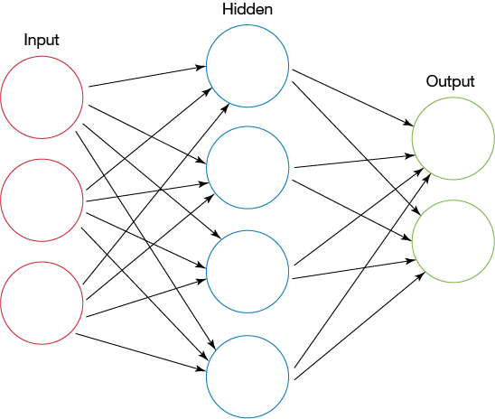
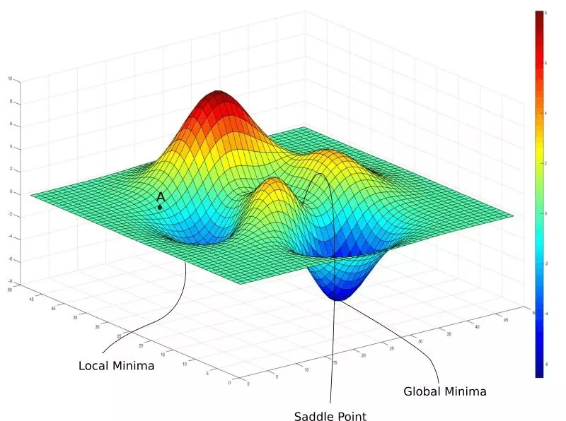
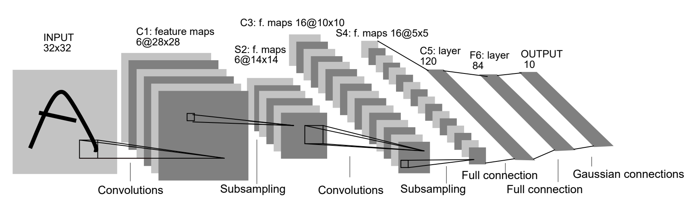

# 基于神经网络的铝合金焊缝成型的预测研究

[TOC]

## 1 绪论

### 1.1 研究背景和意义

焊接是一种以加热或加压方式对材料进行接合的工艺及技术。其操作要求严苛，对操作人员有着较高的熟练要求，且工作环境恶劣，操作人员常常处于高危且有毒的环境中，存在着很多的潜在危险[1]。而焊接机器人的应用能大大改善上述问题。它能够提供稳定且均一的焊缝，使得焊缝质量更有保障[2]。同时也改善了操作人员的劳动条件，操作人员只需要装卸工件，就可避免接触有毒的气体和弧光等。另外，由于焊接机器人可以二十四小时连续生产，因此它的生产效率更高。由此可见，智能化与自动化生产已经成为了现代焊接技术发展的必然趋势。

现代焊接机器人主要根据视觉、电弧、力矩等相关传感器获取焊接环境的相关信息，经过智能化控制与调节来优化自身的焊接轨迹，从而完成复杂的焊接任务[3]。然而近年来焊接机器人的应用飞速增长，同时焊接机器人的应用领域也逐渐趋向复杂多变，焊接控制技术迎来了极大的挑战。由于焊接过程充满了强烈的弧光辐射、焊渣的飞溅、灰尘等不确定因素，还有着高温、氧化等等问题[4]，都会对焊接机器人所接收到的传感器数据产生影响，以至于焊接产生偏差，影响焊缝质量。为了使得焊接机器人能够应对这些问题，焊接机器人必须有比较强的抗干扰能力。

焊缝的尺寸能在一定的程度上表征焊缝的质量，宽度均匀且一致的焊缝往往质量也较佳。如果能够通过现有参数来预测焊缝尺寸，也就能提前预知并调整焊缝质量，进而获得优质的焊缝。然而影响焊缝质量的因素众多，难以直接推理出精准的预测公式，往往需要利用机器学习算法对已有数据进行拟合。其中神经网络对非线性模型有着极强的拟合能力，同时也有着极佳的抗干扰性，它能够从焊接参数中提取出鲁棒的表示，进而较为精准地预测出焊缝尺寸。

基于上述分析，本文利用神经网络对焊接过程中传感器采集到的数据与对应的焊缝尺寸进行拟合，并对模型准确率进行评估，以便在焊接过程中获得宽度均匀的焊缝，为后续焊接自动化控制奠定了基础。

### 1.2 神经网络研究现状

神经网络（Neural Network，NN）的相关研究在很早以前就已经出现，而如今已经形成了一个相当大的多学科交叉的学科领域[5]。通常所说的神经网络是指人工神经网络（ANN），是机器学习领域中的一种模仿生物神经网络的结构和功能的数学模型或计算模型。

#### 1.2.1 神经网络基本模型

生物神经网络最基本的单元是生物神经元（neuron）。生物神经元的基本结构如图 1.1 所示，当一个神经元的电位达到一个阈值时，它会转变为“兴奋”状态，进而向下一个神经元传递神经递质，以影响下一个神经元的电位。生物神经元彼此连接形成网状结构，从而能够完成复杂的功能。

图 1.1 生物神经元结构

1943 年，McCulloch 与 Pitts 将上述情形抽象为一个如图 1.2 所示的简单的数学模型，也就是人工神经网络中最经典的 “M-P 神经元模型”[6]。类似于生物神经元的概念，M-P 神经元接收前驱 $n$ 个神经元的输入信号，并对每个信号赋予一定的权重进行加和，得到 $\sum\limits_{i=1}^n w_i x_i$，将其作为该神经元的信号。当该信号值达到阈值 $\theta$ 时向下一个神经元传递信号，也就是向后一神经元传递信号 $y = f(\sum\limits_{i=1}^n w_i x_i - \theta)$。其中 $f$ 为激活函数，这里使用的是阶跃函数，也即 $f(x) = sgn(x)$。然而由于阶跃函数具有不连续、不光滑等问题，实际应用中常使用 $Sigmoid$ 函数作为激活函数。

图 1.2 M-P 神经元结构

类似于生物神经网络，将神经元彼此连接便形成了人工神经网络。单层神经网络只包含一个输入层和一个输出层，由于输入层神经元仅接收外界输入而不对数据进行处理，所以输入层往往不计入层数中。单层神经网络的处理能力有限，很难解决线性不可分的问题，所以常见的神经网络一般是两层以上的。两层的神经网络又称为单隐层神经网络（如图 1.3），它包含了一个输入层（input layer）、一个隐藏层（hidden layer）和一个输出层（output layer）。输入层和输出层分别接收外界输入和将输出传输给外界，隐藏层和输出层都有着数据处理的功能。

图 1.3 单隐层神经网络结构

由于深度学习技术的不断发展，一些变体网络结构随之产生，它们对某一种或一类特定的问题都有着较强的处理能力。比如擅长处理计算机视觉问题的卷积神经网络（Convolutional neural network, CNN）、擅长处理非欧拓扑结构数据的图神经网络（Graph neural network, GNN）、擅长自然语言处理的 Transformer 等等。

#### 1.2.2 神经网络的优化方法

由于神经网络的输出结果是与预期的输出结果有一定的误差的，为了使得神经网络的输出结果更加地精确，需要对神经网络的参数进行优化，其中最有效也是最常用的优化方法是 Hinton 提出的误差逆传播（error BackPropagation，简称 BP）算法[7]。BP 算法基于梯度下降（gradient descent）策略，以目标的负梯度方向对参数进行调整，旨在降低神经网络的整体误差，经过训练后的神经网络明显能够提高准确率。

BP 优化算法虽然能够非常有效地降低网络误差，但是它只是一种局部搜索算法，在训练过程中非常容易陷入局部最优的位置，导致进一步优化困难等问题。为了跳出局部极小以尽可能地逼近全局最小，人们常采用遗传算法（genetic algorithms, GA）、模拟退火（simulated annealing, SA）算法来逼近全局最优。

图 1.4 网络优化时的全局最小与局部极小

遗传算法（Genetic Algorithm, GA）是模拟达尔文生物进化论的自然选择和遗传学机理的生物进化过程的计算模型，是一种通过模拟自然进化过程搜索最优解的方法。它以个体（individual）为优化对象，以种群（population）为搜索空间，通过选择（selection）、交叉（crossover）与变异（mutation）选取出更优的个体。其本质是一种高效、并行、全局搜索的方法，能在搜索过程中自动获取和积累有关搜索空间的知识，并自适应地控制搜索过程以求得最佳解。

模拟退火算法（simulated annealing, SA）是对冶金学退火过程进行模拟的算法。它将热力学的理论用在统计学上，将搜寻空间内每一点想像成金属内的原子，将该位置的合适程度作为该原子的能量，而到达相邻位置的概率取决于两点“能量”之差。可以证明，模拟退火算法所得解依概率收敛到全局最优解。

此外，还有一些在 BP 优化的基础上进行优化的算法，比如随机梯度下降（Stochastic gradient descent, SGD）、Momentum 优化等方法。这些方法都在一定程度上使得网络获得更好的性能，但由于这些技术大多都是启发式算法，理论上尚缺乏保障。

#### 1.2.3 神经网络面临的难点

正由于神经网络具有强大的表示能力，神经网络经常遭遇过拟合问题。为了解决该问题，需要使用正则化（regularization）或 Early Stopping 等方案。

在网络训练初期，训练误差与验证误差往往是同时下降的，此时网络学到了比较泛化的表示。随着训练迭代次数的增加，网络可能会将训练集中独有的特征当作所有潜在样本所具有的一般特征，这将会导致网络泛化能力下降，这便是过拟合现象。这在误差上表现为训练误差仍在下降而验证误差不下降或反而上升。为了使得模型学习到最泛化的表示，可以在刚刚发生过拟合时停止网络的训练，这便是 Early Stopping。

另外，网络能够过拟合的主要原因是网络具有极高的拟合能力，如果能够限制网络的拟合能力，那么网络将会更倾向于学习泛化的表示。该方式被称为正则化，常用的正则化方法有 L2 正则化与 dropout。L2 正则化方式通过降低权重的 L2 范数以达到限制模型的拟合能力，提高模型的泛化能力。dropout 在训练过程中随机使某些神经元失活的情况下依然要求神经网络输出预期结果，使得整个网络不过分依赖于任一个神经元，从而减弱过拟合现象[8]。

梯度弥散（vashing gradient）问题是一种在深度神经网络中常见的问题，当使用反向传播方法计算导数的时候，随着网络的深度的增加，反向传播的梯度的梯度值会急剧地减小。由于 BP 神经网络早期使用的激活函数是具有饱和特性的 Sigmoid，其在较小或者较大的输入时导数趋于 0，也就导致了梯度无法传递，参数不能得到更新。

在深度学习崛起的前夕，有两个深度模型突破了限制，达到了更深的网络结构，一个是深度信念网络（deep belief network，DBN）[9]，一个是堆叠自编码器（stacked auto encoder）。两者有着相似的结构与训练方式，前者是由多个受限玻尔兹曼机（Restricted Boltzmann Machine，RBM）相互堆叠后添加一个分类器而成，后者是由多个自编码器（auto encoder，AE）堆叠而成，它们的训练方式都是先进行逐层无监督预训练（pre-training），后使用有监督的微调（fine-tuning）。这种训练方式的有效性主要来源于无监督预训练可以降低网络的方差，起到了一定的正则化效果。另一方面，随机梯度下降的网络训练的早期行为会造成很大的影响，这可能导致后期无论多少次迭代都无法跳出某一个局部最小，而无监督预训练能够将网络参数初始化在一个较好的位置，使其更加接近全局最优[10]。然而该方法并没有解决梯度弥散的问题，所以神经网络的深度仍然非常受限。但该方法确实可以在一定程度上提高模型的精度，而且在拥有大量无标签数据与少量有标签数据的情况下，该方法是更为合适的选择，这种训练方式也被称为半监督学习（Semi-supervised learning）。

为了解决梯度弥散的问题，Xavier Glorot 提出对参数进行合理的初始化以保证前向传播与反向传播时数据的分布不会发生太大改变[11]，随后 Geoffrey Hinton 提出使用 ReLU 作为激活函数[12]，这也是如今最常用的激活函数。但 ReLU 激活函数在负值时仍然没有梯度，会导致神经元死掉，Andrew Maas 提出了 LeakyReLU 激活函数进一步缓和了该问题[13]。但网络更深的时候，梯度弥散就会死灰复燃，何恺明在 ResNet 提出了残差训练的概念，极大地提高了神经网络的深度[14]。

### 1.3 焊接过程预测技术研究现状

如果能够对焊接过程进行预测，那么就能够通过调整焊接参数来提高焊接质量。但由于焊接过程涉及多种复杂因素，很难人工推导出对焊接结果的预测公式，因此常需要机器学习技术对已有数据进行拟合，获得较为准确的预测模型。其中，机器学习常用算法有决策树（decision tree）、支持向量机、神经网络、k 近邻（k-nearest neighbor，k-NN）算法等。

#### 1.3.1 机器学习算法在预测过程的应用现状

机器学习是人工智能的一个分支，涉及概率论、统计学、逼近论、凸分析、计算复杂性理论等多门学科。机器学习理论主要是设计和分析一些让计算机可以自动“学习”的算法。机器学习算法是一类从数据中自动分析获得规律，并利用规律对未知数据进行预测的算法。算法设计方面，机器学习理论关注可以实现的，行之有效的学习算法。很多推论问题属于无程序可循难度，所以部分的机器学习研究是开发容易处理的近似算法。机器学习目前已经广泛应用于数据挖掘、计算机视觉、自然语言处理、医学诊断、语音和手写识别等等领域。

图 1.5 机器学习的简单流程

机器学习在医疗诊断上有着广泛的应用，目前在药剂化学性质、认知行为疗法、链路预测问题、全身骨闪烁图、早期诊断、严重性预测器、代谢组学研究和基因组挖掘等方面有着非常高的研究热度[15]，且在医学影像、临床决策支持、语音识别、药物挖掘、健康管理、病理学等众多领域取得突破性进展[16]，这对提高医疗系统诊断准确性、安全性和可靠性有着重要帮助。

机器学习在化学领域也有着很多的应用，它可以帮助分子和材料的设计、合成与表征，以加速科研的研究进程[17]。在化学合成中，需要人类专家来指定特定的条件和上下步的规则，这些规则在给定的步骤中排除了大量可能用到的试剂,限制了可供选择的算法数量。如果依赖于传统算法的机器要与专家竞争，那么上下步规则（通常是数千个）就显得至关重要。深度学习方法对预测化学合成路径表现出特殊的应用前景，其通过将基于规则的专家系统和神经网络相结合的方案来实现这一目的，而该神经网络是对候选合成路径的排序或者是通过应用规则对预测产物的可能性进行组合而生成的。此外，机器学习还能够帮助研究者发现新型化合物、辅助多维表征、甚至加强理论化学。

当今机器学习最主要的算法是神经网络，由于其具有强大的拟合能力，且很容易堆叠多层，因此在此基础上产生了深度学习这一学科。深层神经网络往往有着比其他机器学习算法更高的性能，这使得它非常适合处理图像、语音、文本等复杂数据，因此被广泛应用于图像分类与识别、语音识别、自然语言处理等等领域。

#### 1.3.2 神经网络在焊接过程预测的应用现状

神经网络是一种非常有效的机器学习算法，它拥有非常强大的学习能力，可以轻松从数据集中发现潜在规律，将神经网络应用于焊接领域中的焊接工艺参数选择与优化、焊缝跟踪、焊接缺陷预测、力学性能预测等都具有比较理想的效果[18]。

传统的 BP 神经网络在焊接预测中已经有着广泛的应用，均取得了不错的效果。张抱日等人利用 BP 神经网络建立了焊接高度与电弧电压的对应关系模型，并进一步实现了焊接高度的自动控制[19]。赵成涛建立了基于 BP 神经网络的镁合金焊缝成形预测模型，利用神经网络的映射能力和分析能力，采用焊接过程的焊接电流、焊接电压、焊接速度、焊丝干伸长作为预测输入，把焊缝成形中的焊缝熔深、熔宽、余高作为信息输出对神经网络进行训练，从而建立基于 BP 神经网络的焊接参数和焊缝成形的映射模型[20]。黄军芬等人利用 BP 神经网络建立了熔池形貌与背面熔宽的模型，对熔透情况进行了预测[21]。Limeng Yin 等人利用双隐层神经网络对焊缝尺寸进行了预测，在网络的设计细节中使用了较新的深度学习技术，取得了较高的预测精度[22]。

虽然传统的 BP 神经网络已经能够取得不错的效果，但由于其本质是一种局部搜索方法，很容易陷入局部最优，使得网络泛化能力下降。遗传算法起源于对生物系统所进行的计算机模拟研究。它是模仿自然界生物进化机制发展起来的随机全局搜索和优化方法，借鉴了达尔文的进化论和孟德尔的遗传学说。Bowen Liu 搭建神经网络来拟合焊接参数与焊接缺陷的映射关系，并使用遗传算法进行优化，并进一步搜索焊接缺陷最低时对应的焊接参数，最终焊接成品有着较好的质量[23]。

遗传算法不仅可以独立使用，还可以结合 BP 算法进一步提高模型的精度，其方法是首先利用遗传算法优化神经网络参数达到一个较优的效果，然后以此为 BP 优化的起点，使用梯度下降法进一步训练以降低误差。该方法被称为 BP-GA 方法，它结合了 GA 和 BP 的优点，首先在全局范围内为 BP 设置了一个比较好的起点，使得之后的 BP 优化能够更加接近全局最优。张喆等人利用 BP-GA 的方法拟合了焊接前进方向温度预测模型和前进侧方向温度预测模型，其预测能力要优于基于传统 BP 神经网络所建立的模型[24]。刘立鹏等人利用 BP-GA 算法对焊接接头力学性能进行预测，达到了预期的精度要求[25]。Hua Ding 等人利用 BP-GA 算法对焊接残余厚度进行了预测，使得网络的预测精度更加准确，收敛速度大大提高[26]。

图 1.6 BP-GA 神经网络权值阈值优化流程

此外，无监督预训练也能够显著提高神经网络的性能。稀疏自编码器（sparse auto encoder，SAE）是自编码器的一种变体，它对参数添加了一个惩罚项，使得被激活的神经元限制数量限制在一个较低的值，换言之，网络会学习到较为稀疏的表示，而稀疏的表示能够在编码时更加有效地对数据进行降维。堆叠稀疏自编码器（stacked sparse auto encoder，SSAE）是由稀疏自编码器堆叠而成的，它相比于堆叠自编码器拥有更好的降维效果，可以学习到更有用的特征。Yanxi Zhang 等人利用 SSAE 对焊接状态进行预测，之后使用 GA 进行超参数搜索，取得了一定的效果，并将该方法称为 SSAE-GA 方法[27]。

图 1.7 SSAE-GA 对神经网络的优化流程

与 SAE 相似，还有一种相似的自编码器被称为降噪自编码器（denoising auto encoder），堆叠后的结构即 SDAE，SDAE 能够从包含噪声的数据中还原数据，因此有着更强的鲁棒性。Johannes Gunther 等人在图像特征提取过程中使用了 SDAE，并使用提取出的特征进行了 SVM 分类测试，仅产生了较低的分类误差。这些提取出的特征用于后续焊接控制神经网络的输入，取得了较好的控制效果[28]。

#### 1.3.3 其它机器学习算法在焊接过程预测的应用

支持向量机可以在高维空间中构造超平面以最大程度地将两类数据分离，支持向量机会最大化两类数据相对于这个超平面之间的距离，这个距离被称为间隔（margin），因此这种线性分类器也常被成为最大间隔分类器[29]。然而这种线性分类器无法对非线性数据进行划分，所以需要在其基础上应用一个核函数，使 SVM 具有非线性分类的能力。由于 SVM 相比于 logitic 回归拥有更加简单的数学表示形式，所以 SVM 在小型的分类任务上往往会有着更好的效果和训练速度。顾盛勇在焊缝视觉检测系统中使用了 SVM 预测焊缝位置，并利用 PCA 算法进行优化[30]。贺峰等人基于多传感器和 SVM 对焊接过程进行模式识别，有效地提高了焊接过程准确率[31]。

随机森林算法也是一种机器学习任务中的常用方法。随机森林算法是一个包含多个决策树的分类器，并且其输出的类别是由个别树输出的类别的众数而定。它对多种数据都能较好地进行分类，但是在类别特别多时它的表现并不会太好。Zhifen Zhang 等人首先使用 PCA 算法对数据进行降维处理，之后使用 RF 进行分类，有效地对焊缝缺陷种类进行预测[32]。Haixing Zhu 等人首先利用 CNN 对熔池图片进行降维，之后使用 RF 进行了有效的分类[33]。

### 1.4 铝合金焊接研究现状

铝合金是一种有色金属结构材料，普遍应用于交通运输、航空航天、电子电力、建筑等领域。由于其复杂的铝合金焊接工艺，其应用范围略小于钢铁等传统结构材料，但铝合金凭借着其密度小、延展性好、耐腐蚀、可塑性好、导电性良好等等特点，其需求量逐年增加。这同时催生出了新型应用领域，且推动了铝合金焊接工艺的相关研究。随着铝合金焊接技术的不断发展和成熟，铝合金材料在各种制造业中的领域不断地深入和发展，而这种逐渐扩大的市场需求也促使着铝合金焊接技术不断地进步[34]。

#### 1.4.1 电弧焊接研究现状

铝合金电弧焊具有易于操作、低成本、方便推广等优点，两种最常见的方法是钨极惰性气体焊接和金属惰性气体焊接。

钨极气体保护焊简称 TIG 或 GTAW，属于非融化极气体保护焊，是利用钨电极与工件之间的电弧使金属熔化而形成焊缝。在金属焊接中，由工件本身作为正极，而将焊炬中的钨电极作为负极，因此电极不熔化，同时电焊柜的喷嘴送进氦气或氩气，起保护电极和熔池的作用，还可根据需要另外添加填充金属。进行 GTAW 焊时，焊接区以遮护气体阻绝大气污染（普遍使用氩等惰性气体），并通常搭配使用焊料（填充金属），但有些自熔焊缝可省略此步骤。焊接时，由传导通过高度离子化的气体和金属蒸气（即等离子）的电弧，作为恒流焊接电源，提供能量。由于钨极惰性气
体焊焊接采用手工操作，故焊接速度慢且生产效率低下。随着工艺的要求和焊接技术的进步，铝合金钨极惰性气体焊由普通交流发展到如今的变极性焊接，而且逐渐有了形式多样的变极性焊接波形[35]，例如采用交流钨极惰性气体焊或者自动钨极惰性气体焊可以大大改善焊接效率和接头的性能。

图 1.8 钨极惰性气体保护焊原理图

金属惰性气体保护焊（MIG 焊）以外加气体作为电弧介质，并保护金属熔滴、焊接熔池和焊接区高温金属的电弧焊方法，称为熔化极气体保护电弧焊。用实芯焊丝的惰性气体（Ar或He）保护电弧焊法称为熔化极惰性气体保护焊，简称 MIG 焊。MIG 焊接除用金属丝代替焊炬内的钨电极外，其它和 TIG 焊一样。因此，焊丝由电弧熔化，送入焊接区。电力驱动辊按照焊接所需从线轴把焊丝送入焊炬。MIG 焊具有氢气低，成本低，效率高，节能，防锈，便于全方位焊接的优点，目前金属惰性气体焊接焊接己经有了较大的进步[36]。例如可以用不同种类焊丝的选择来处理不同被焊材料，从而提高焊接质量。

图 1.9 金属惰性气体保护焊原理

#### 1.4.2 激光焊接研究现状

激光焊接是利用高能量密度的激光束作为热源的一种高效精密焊接方法。激光焊接是激光材料加工技术应用的重要方面之一，它相比于其它焊接方式有着能量密度高、焊接质量高、焊接的精度高等等的优势[37]。此外，激光焊接可实现自动化，可实现网络化加工设置，焊接过程智能化、自动化，从而进一步提高焊接质量，保证焊接加工工艺[38]。目前已经广泛应用于石油管道、汽车制造业、航空航天工业等众多领域中。我国的激光焊接处于世界先进水平，具备了使用激光成形超过 12 平方米的复杂钛合金构件的技术和能力，并投入多个国产航空科研项目的原型和产品制造中。

激光焊接技术按聚焦后激光束能量密度大小不同可划分为两种典型的焊接模式，分别为热传导焊接与深熔焊接，热传导焊接与深熔焊接示意图如图 1.10 所示[39]。两种焊接方式的主要区别为激光束的能量密度。热传导焊接时使用的激光束能量密度在 104-105W/cm2 范围，将该激光束照射到工件表面，金属会受热熔化，然而其表面热量只能通过热传导的方式向工件内部扩散，因此其熔深较浅，熔宽也较小。深熔焊接所使用的激光束能量密度高于 107W/cm2，其照射到工件表面时，会导致表面金属迅速熔化并发生汽化现象，形成的蒸汽反冲压力将熔池中的液态金属抛出，使得激光作用处的熔池下凹形成匙孔。激光束在匙孔内部多次反射，使匙孔进一步加深，最终在液态金属中形成匙孔，同时在匙孔内充满因高温蒸气部分电离而形成的等离子体，匙孔上方也形成一定范围的等离子云。由于匙孔的形成，激光深熔焊最终形成深而窄的焊缝。然而，由于熔池吸收能量密度较大，这种焊接模式下熔池搅动较为剧烈，容易卷入空气形成焊接气孔[40]。此外，由于能量密度过高，材料剧烈汽化还会大量光致等离子气团，阻碍母材对激光能量的进一步吸收，熔池温度随之降低，等离子气团逐渐消失。之后，激光照射到工件表面重新形成大量的等离子气团，再次阻碍母材对激光能量的吸收，如此反复，光致等离子气团周期性分布将导致焊接过程不稳定[41]。通过优化焊接坡口，调节激光焊接功率密度，离焦量，焊接速度，保护气体流量等方法可以降低光致等离子气团对焊接过程的不利影响[42]。

图 1.10 激光热传导焊与深熔焊原理示意图

虽然激光焊接有着诸多优点，但仍然存在一定的弊端，诸如热裂纹、容易出现气孔问题是激光焊接中的常见问题。此外，铝合金对激光的吸收率相对较低，会大大降低焊接的效率，为了解决该问题，常使用提高激光功率密度、采取喷砂、电解抛光以及阳极氧化等预处理工艺等措施[43]。在技术与应用中规免上述问题，才能最大化激光焊接的生产率。

#### 1.4.3 激光-电弧复合焊接研究现状

激光-电弧复合焊接技术是基于综合单独的激光焊接和电弧焊接而产生的。电弧焊接早已大量应用于生产，但其焊接效率低、变形大、耗材昂贵，对焊工要求高，可焊铝合金种类有限。激光焊接由于焊接功率密度高、熔宽比大，焊速快、变形小，得到了广泛的研发应用。但是，大功率激光器价格昂贵，搭桥能力差，对焊接预处理要求高。将激光 、电弧复合起来，同时作用于焊接件，其效果不只是两种焊接作用的简单叠加，而是可以起到“1+1>2”的协同效应[44]。由于电弧焊分为 MIG 焊和 TIG 焊，因此激光电弧复合焊也分为激光-MIG 复合焊和激光-TIG 复合焊。

激光-MIG 复合焊接是将激光与电弧的能量共同作用于工件同一位置实现连接的过程,其基本原理如图一所示。激光-MIG 复合焊接不是两种单热源的简单叠加，而是两者相互作用、相互加强，发挥两者优势，形成一种复合、高效的热源，其工艺稳定性高，能够大幅度提高焊接适应性和焊接效率。我国科研人员早就关注到激光-MIG 复合焊接技术在铝合金焊接中的优势，已有多家研究机构开展了相关研究工作。例如，北京钢铁研究总院的许良红等人曾采用激光-MIG 焊接方法对 20mm 厚、开 U 形口的 2519-T87 铝合金实施多道焊接，主要在于探索复合焊接工艺与焊缝组织性能之间的关系[45]。雷正龙等人开展了 5mm 厚度 LF6 铝合金的 CO2 激光-MIG 复合焊接实验，得到而来成形良好的焊缝[46]。

图 1.11 激光-MIG 复合焊接原理图

激光-TIG 复合焊接是激光焊接与 TIG 焊的复合焊接形式，它与激光焊接相比，焊接效率显著提高，激光的能量利用率明显增大，焊接过程也变得相对稳定，焊接成型均匀美观，极大地减少了表面发黑的情况。而且采用激光与 TIG 电弧的复合焊接能够解决单独使用电弧焊接时的严重变形情况，也能够减缓单独使用激光焊接时存在的焊前准备要求高，装配环节较复杂等问题，复合焊接在薄板（0.8mm）或是中厚板（4mm）铝合金的焊接生产中有很大的优势与发展需求。

### 1.5 本文研究的主要内容

常见的焊缝预测方法通常是使用焊接工艺参数作为预测模型的输入特征，通过神经网络来预测焊缝的形状。其中神经网络大多采用单隐层结构，并使用 BP 方法优化神经网络，虽然该结构已经能够满足大多数的应用需求，但焊接控制往往需要更高的准确度与精度，因此需要进一步提高预测效果。

针对 BP 算法中常见的收敛到局部极小的问题，本文尝试采用 BP-GA 算法对神经网络进行优化，也即首先使用 GA 算法将神经网络的权重初始化到一个更加接近全局最优的位置，之后再使用 BP 算法进一步提高精度。

另一方面，由于深层神经网络往往具有更加优良的效果，因此本文尝试采用较为深层的神经网络来拟合该预测过程。但由于深层神经网络往往难以训练，故采用 SSAE 的方式来训练网络，并通过 GA 来搜索网络的超参数。此外还可以尝试采用深度学习中常用的诸如 ReLU 激活、dropout 正则化等优化技巧来提高精度。

## 2 实验材料、设备及方法

### 2.1 实验材料

铝合金板

### 2.2 实验设备
#### 2.2.1 激光-电弧复合焊接设备
#### 2.2.2 ...
### 2.3 实验方法
#### 2.3.1 焊接实验
#### 2.3.2 神经网络预测实验

设计路线什么的 比如 BP-GA 设计的

# Refs

1. 王田苗. 我国工业机器人技术现状与产业化发展战略
2. 邱葭菲. TIG 打底焊工艺研究
3. 霍厚志. 我国焊接机器人应用现状与技术发展趋势
4. 孟宪伟. 焊接智能化的研究现状及应用
5. 周志华. 机器学习
6. M-P 神经元论文
7. BP 论文
8. dropout2012
9. 无监督优化 RBM 论文 2006
10. Dumitru Erhan. Why Does Unsupervised Pre-training Help Deep Learning?
11. Xavier Glorot 初始化
12. ReLU 的论文
13. Leaky ReLU
14. ResNet
15. 张景奇. 机器学习在医疗和公共卫生中应用
16. 互联网医疗健康产业联盟. 2018 年医疗人工智能技术与应用白皮书[R]. 2018.
17. Butler K T,Davies D W,Cartwright H,et al. Machine learning for molecular and materials science[J]. Nature,2018,559(7715).
18. 裴浩东．人工神经网络及其在焊接中的应用
19. 张抱日. 基于焊缝熔透检测的机器人深熔 K-TIG 焊接系统
20. 赵成涛. 基于 BP 神经网络的镁合金焊缝成形预测
21. 黄军芬. 基于视觉传感的 GMAW 熔透状态预测
22. Limeng Yin. Prediction of weld formation in 5083 aluminum alloy by twin-wire CMT welding based on deep learning
23. Bowen Liu. Optimal design for dual laser beam butt welding process parameter using artificial neural networks and genetic algorithm for SUS316L austenitic stainless steel
24. 张喆. 基于遗传 BP 神经网络的搅拌摩擦焊温度模型
25. 刘立鹏. 基于遗传神经网络的焊接接头力学性能预测系统
26. Hua Ding. Research on laser processing technology of instrument panel implicit weakening line based on neural network and genetic algorithm
27. Yanxi Zhang. Real‑time monitoring of high‑power disk laser welding statuses based on deep learning framework
28. Johannes Gunther. Intelligent Laser Welding through Representation, Prediction, and Control Learning: An Architecture with Deep Neural Networks and Reinforcement Learning
29. 统计学习方法. 李航
30. 顾盛勇. 基于视觉传感的高效深熔锁孔TIG焊焊缝识别及熔透状态的研究
31. 贺峰. 基于多传感器和支持向量机的 GMAW 焊接过程模式识别研究
32. Zhifen Zhang. Real-time seam defect identification for Al alloys in robotic arc welding using optical spectroscopy and integrating learning mechanisms in 20kw-class CO2 laser welding processes[J]. Journal of Physics D:Applied Physics, 2002, 36(2): 192.
33. Haixing Zhu. Deep Learning-Based Classification of Weld Surface Defects
34. 林建波. 铝合金焊接技术研究
35. 陈国庆. 铝合金焊接工艺的研究进展
36. 涂俊俊. 熔化极气体保护焊弧长控制技术研究
37. 胡裕祺. 铝合金激光焊接研究
38. 毛帅. 5052 铝合金光纤激光扫描焊接工艺研究
39. Tu J F, Inoue T, Miyamoto I. Quantitative characterization of keyhole absorption
40. 陈武柱, 张旭东, 任家烈, 等. 激光焊接时焊接模式转变规律及焊接过程稳定性的研究[J]. 中国激光, 1996, 23(7): 659-661.
41. Matsunawa A. Understanding physical mechanism in laser welding for mathematical modeling and process monitoring[C]//Proceedings of the LIM'2001 Conference, Munich, Germany. 2001:79-93.
42. 刘锟, 刘金合, 周畅. 激光深熔焊接光致等离子体的控制[J]. 热加工工艺, 2007, 36(23):86-87.
43. 胡裕祺. 铝合金激光焊接研究
44. 辜磊. 激光-电弧复合焊接技术在船舶制造中的应用研究
45. 许良红. 激光-MIG复合焊接工艺参数对焊缝形状的影响
46. 雷正龙,陈彦宾,李俐群,吴林激光-MIG复合焊接射滴过渡的熔滴特性中国有色金属学报,2004,14(6):956-960.
