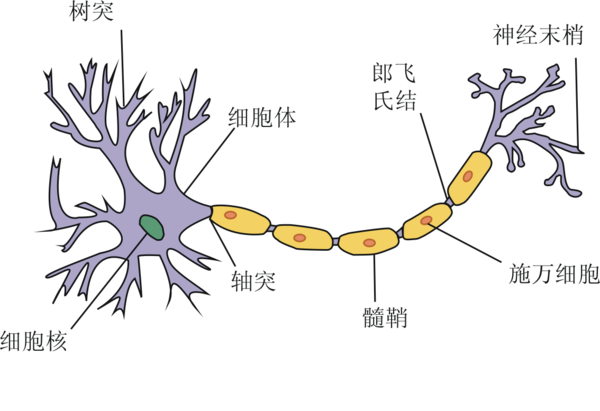
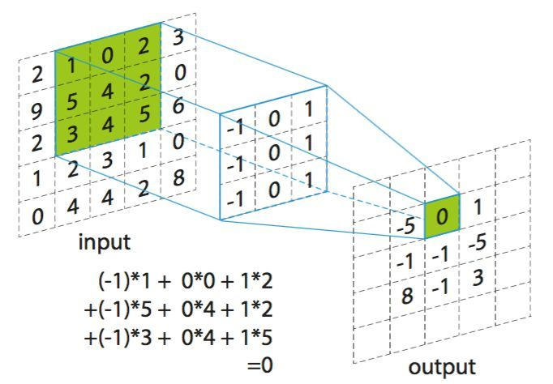
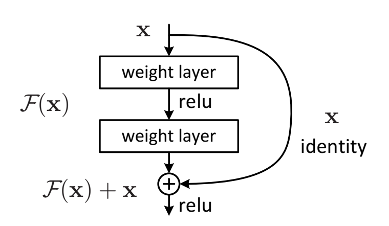

# 基于神经网络的铝合金焊缝成型的预测研究

[TOC]

## 1 绪论

### 1.1 研究背景和意义

焊接是一种以加热或加压方式对材料进行接合的工艺及技术。其操作要求严苛，对操作人员有着较高的熟练要求，且工作环境恶劣，操作人员常常处于高危且有毒的环境中，存在着很多的潜在危险[1]。而焊接机器人的应用能大大改善上述问题。它能够提供稳定且均一的焊缝，使得焊缝质量更有保障[2]。同时也改善了操作人员的劳动条件，操作人员只需要装卸工件，就可避免接触有毒的气体和弧光等。另外，由于焊接机器人可以二十四小时连续生产，因此它的生产效率更高。由此可见，智能化与自动化生产已经成为了现代焊接技术发展的必然趋势。

现代焊接机器人主要根据视觉、电弧、力矩等相关传感器获取焊接环境的相关信息，经过智能化控制与调节来优化自身的焊接轨迹，从而完成复杂的焊接任务[3]。然而近年来焊接机器人的应用飞速增长，同时焊接机器人的应用领域也逐渐趋向复杂多变，焊接控制技术迎来了极大的挑战。由于焊接过程充满了强烈的弧光辐射、焊渣的飞溅、灰尘等不确定因素，还有着高温、氧化等等问题[4]，都会对焊接机器人所接收到的传感器数据产生影响，以至于焊接产生偏差，影响焊缝质量。为了使得焊接机器人能够应对这些问题，焊接机器人必须有比较强的抗干扰能力。

焊缝的尺寸能在一定的程度上表征焊缝的质量，宽度均匀且一致的焊缝往往质量也较佳。如果能够通过现有参数来预测焊缝尺寸，也就能提前预知并调整焊缝质量，进而获得优质的焊缝。然而影响焊缝质量的因素众多，难以直接推理出精准的预测公式，往往需要利用机器学习算法对已有数据进行拟合。其中神经网络对非线性模型有着极强的拟合能力，同时也有着极佳的抗干扰性，它能够从焊接参数中提取出鲁棒的表示，进而较为精准地预测出焊缝尺寸。

基于上述分析，本文利用神经网络对焊接过程中传感器采集到的数据与对应的焊缝尺寸进行拟合，并对模型准确率进行评估，以便在焊接过程中获得宽度均匀的焊缝，为后续焊接自动化控制奠定了基础。

### 1.2 神经网络研究现状

神经网络（Neural Network，NN）的相关研究在很早以前就已经出现，而如今已经形成了一个相当大的多学科交叉的学科领域[5]。通常所说的神经网络是指人工神经网络（ANN），是机器学习领域中的一种模仿生物神经网络的结构和功能的数学模型或计算模型。

#### 1.2.1 神经网络基本模型

生物神经网络最基本的单元是生物神经元（neuron）。生物神经元的基本结构如图 1.1 所示，当一个神经元的电位达到一个阈值时，它会转变为“兴奋”状态，进而向下一个神经元传递神经递质，以影响下一个神经元的电位。生物神经元彼此连接形成网状结构，从而能够完成复杂的功能。

图 1.1 生物神经元结构

1943 年，McCulloch 与 Pitts 将上述情形抽象为一个如图 1.2 所示的简单的数学模型，也就是人工神经网络中最经典的 “M-P 神经元模型”[6]。类似于生物神经元的概念，M-P 神经元接收前驱 $n$ 个神经元的输入信号，并对每个信号赋予一定的权重进行加和，得到 $\sum\limits_{i=1}^n w_i x_i$，将其作为该神经元的信号。当该信号值达到阈值 $\theta$ 时向下一个神经元传递信号，也就是向后一神经元传递信号 $y = f(\sum\limits_{i=1}^n w_i x_i - \theta)$。其中 $f$ 为激活函数，这里使用的是阶跃函数，也即 $f(x) = sgn(x)$。然而由于阶跃函数具有不连续、不光滑等问题，实际应用中常使用 $Sigmoid$ 函数作为激活函数。

图 1.2 M-P 神经元结构

类似于生物神经网络，将神经元彼此连接便形成了人工神经网络。单层神经网络只包含一个输入层和一个输出层，由于输入层神经元仅接收外界输入而不对数据进行处理，所以输入层往往不计入层数中。单层神经网络的处理能力有限，很难解决线性不可分的问题，所以常见的神经网络一般是两层以上的。两层的神经网络又称为单隐层神经网络（如图 1.3），它包含了一个输入层（input layer）、一个隐藏层（hidden layer）和一个输出层（output layer）。输入层和输出层分别接收外界输入和将输出传输给外界，隐藏层和输出层都有着数据处理的功能。

图 1.3 单隐层神经网络结构

由于深度学习技术的不断发展，一些变体网络结构随之产生，它们对某一种或一类特定的问题都有着较强的处理能力。比如擅长处理计算机视觉问题的卷积神经网络（Convolutional neural network, CNN）、擅长处理非欧拓扑结构数据的图神经网络（Graph neural network, GNN）、擅长自然语言处理的 Transformer 等等。

#### 1.2.2 神经网络的优化方法

由于神经网络的输出结果是与预期的输出结果有一定的误差的，为了使得神经网络的输出结果更加地精确，需要对神经网络的参数进行优化，其中最有效也是最常用的优化方法是 Hinton 提出的误差逆传播（error BackPropagation，简称 BP）算法[7]。BP 算法基于梯度下降（gradient descent）策略，以目标的负梯度方向对参数进行调整，旨在降低神经网络的整体误差，经过训练后的神经网络明显能够提高准确率。

BP 优化算法虽然能够非常有效地降低网络误差，但是它只是一种局部搜索算法，在训练过程中非常容易陷入局部最优的位置，导致进一步优化困难等问题。为了跳出局部极小以尽可能地逼近全局最小，人们常采用遗传算法（genetic algorithms, GA）、模拟退火（simulated annealing, SA）算法来逼近全局最优。

图 1.4 网络优化时的全局最小与局部极小

遗传算法（Genetic Algorithm, GA）是模拟达尔文生物进化论的自然选择和遗传学机理的生物进化过程的计算模型，是一种通过模拟自然进化过程搜索最优解的方法。它以个体（individual）为优化对象，以种群（population）为搜索空间，通过选择（selection）、交叉（crossover）与变异（mutation）选取出更优的个体。其本质是一种高效、并行、全局搜索的方法，能在搜索过程中自动获取和积累有关搜索空间的知识，并自适应地控制搜索过程以求得最佳解。

模拟退火算法（simulated annealing, SA）是对冶金学退火过程进行模拟的算法。它将热力学的理论用在统计学上，将搜寻空间内每一点想像成金属内的原子，将该位置的合适程度作为该原子的能量，而到达相邻位置的概率取决于两点“能量”之差。可以证明，模拟退火算法所得解依概率收敛到全局最优解。

此外，还有一些在 BP 优化的基础上进行优化的算法，比如随机梯度下降（Stochastic gradient descent, SGD）、Momentum 优化等方法。这些方法都在一定程度上使得网络获得更好的性能，但由于这些技术大多都是启发式算法，理论上尚缺乏保障。

#### 1.2.3 神经网络面临的难点

正由于神经网络具有强大的表示能力，神经网络经常遭遇过拟合问题。为了解决该问题，需要使用正则化（regularization）或 Early Stopping 等方案。

在网络训练初期，训练误差与验证误差往往是同时下降的，此时网络学到了比较泛化的表示。随着训练迭代次数的增加，网络可能会将训练集中独有的特征当作所有潜在样本所具有的一般特征，这将会导致网络泛化能力下降，这便是过拟合现象。这在误差上表现为训练误差仍在下降而验证误差不下降或反而上升。为了使得模型学习到最泛化的表示，可以在刚刚发生过拟合时停止网络的训练，这便是 Early Stopping。

另外，网络能够过拟合的主要原因是网络具有极高的拟合能力，如果能够限制网络的拟合能力，那么网络将会更倾向于学习泛化的表示。该方式被称为正则化，常用的正则化方法有 L2 正则化与 dropout。L2 正则化方式通过降低权重的 L2 范数以达到限制模型的拟合能力，提高模型的泛化能力。dropout 在训练过程中随机使某些神经元失活的情况下依然要求神经网络输出预期结果，使得整个网络不过分依赖于任一个神经元，从而减弱过拟合现象[8]。

梯度弥散（vashing gradient）问题是一种在深度神经网络中常见的问题，当使用反向传播方法计算导数的时候，随着网络的深度的增加，反向传播的梯度的梯度值会急剧地减小。由于 BP 神经网络早期使用的激活函数是具有饱和特性的 Sigmoid，其在较小或者较大的输入时导数趋于 0，也就导致了梯度无法传递，参数不能得到更新。

在深度学习崛起的前夕，有两个深度模型突破了限制，达到了更深的网络结构，一个是深度信念网络（deep belief network，DBN）[9]，一个是堆叠自编码器（stacked auto encoder）。两者有着相似的结构与训练方式，前者是由多个受限玻尔兹曼机（Restricted Boltzmann Machine，RBM）相互堆叠后添加一个分类器而成，后者是由多个自编码器（auto encoder，AE）堆叠而成，它们的训练方式都是先进行逐层无监督预训练（pre-training），后使用有监督的微调（fine-tuning）。这种训练方式的有效性主要来源于无监督预训练可以降低网络的方差，起到了一定的正则化效果。另一方面，随机梯度下降的网络训练的早期行为会造成很大的影响，这可能导致后期无论多少次迭代都无法跳出某一个局部最小，而无监督预训练能够将网络参数初始化在一个较好的位置，使其更加接近全局最优[10]。然而该方法并没有解决梯度弥散的问题，所以神经网络的深度仍然非常受限。但该方法确实可以在一定程度上提高模型的精度，而且在拥有大量无标签数据与少量有标签数据的情况下，该方法是更为合适的选择，这种训练方式也被称为半监督学习（Semi-supervised learning）。

为了解决梯度弥散的问题，Xavier Glorot 提出对参数进行合理的初始化以保证前向传播与反向传播时数据的分布不会发生太大改变[11]，随后 Geoffrey Hinton 提出使用 ReLU 作为激活函数[12]，这也是如今最常用的激活函数。但 ReLU 激活函数在负值时仍然没有梯度，会导致神经元死掉，Andrew Maas 提出了 LeakyReLU 激活函数进一步缓和了该问题[13]。但网络更深的时候，梯度弥散就会死灰复燃，何恺明在 ResNet 提出了残差训练的概念，极大地提高了神经网络的深度[14]。

### 1.3 焊接过程预测技术研究现状

如果能够对焊接过程进行预测，那么就能够通过调整焊接参数来提高焊接质量。但由于焊接过程涉及多种复杂因素，很难人工推导出对焊接结果的预测公式，因此常需要机器学习技术对已有数据进行拟合，获得较为准确的预测模型。其中，机器学习常用算法有决策树（decision tree）、支持向量机、神经网络、k 近邻（k-nearest neighbor，k-NN）算法等。

#### 1.3.1 机器学习算法在预测过程的应用现状

#### 1.3.2 神经网络在焊接过程预测的应用现状

神经网络是一种非常有效的机器学习算法，它拥有非常强大的学习能力，可以轻松从数据集中发现潜在规律，将神经网络应用于焊接领域中的焊接工艺参数选择与优化、焊缝跟踪、焊接缺陷预测、力学性能预测等都具有比较理想的效果[37]。

传统的 BP 神经网络在焊接预测中已经有着广泛的应用，均取得了不错的效果。张抱日等人利用 BP 神经网络建立了焊接高度与电弧电压的对应关系模型，并进一步实现了焊接高度的自动控制[39]。赵成涛建立了基于 BP 神经网络的镁合金焊缝成形预测模型，利用神经网络的映射能力和分析能力，采用焊接过程的焊接电流、焊接电压、焊接速度、焊丝干伸长作为预测输入，把焊缝成形中的焊缝熔深、熔宽、余高作为信息输出对神经网络进行训练，从而建立基于 BP 神经网络的焊接参数和焊缝成形的映射模型[38]。黄军芬等人利用 BP 神经网络建立了熔池形貌与背面熔宽的模型，对熔透情况进行了预测[40]。Limeng Yin 等人利用双隐层神经网络对焊缝尺寸进行了预测，在网络的设计细节中使用了较新的深度学习技术，取得了较高的预测精度[44]。

虽然传统的 BP 神经网络已经能够取得不错的效果，但由于其本质是一种局部搜索方法，很容易陷入局部最优，使得网络泛化能力下降。遗传算法起源于对生物系统所进行的计算机模拟研究。它是模仿自然界生物进化机制发展起来的随机全局搜索和优化方法，借鉴了达尔文的进化论和孟德尔的遗传学说。Bowen Liu 搭建神经网络来拟合焊接参数与焊接缺陷的映射关系，并使用遗传算法进行优化，并进一步搜索焊接缺陷最低时对应的焊接参数，最终焊接成品有着较好的质量[41]。

遗传算法不仅可以独立使用，还可以结合 BP 算法进一步提高模型的精度，其方法是首先利用遗传算法优化神经网络参数达到一个较优的效果，然后以此为 BP 优化的起点，使用梯度下降法进一步训练以降低误差。该方法被称为 BP-GA 方法，它结合了 GA 和 BP 的优点，首先在全局范围内为 BP 设置了一个比较好的起点，使得之后的 BP 优化能够更加接近全局最优。张喆等人利用 BP-GA 的方法拟合了焊接前进方向温度预测模型和前进侧方向温度预测模型，其预测能力要优于基于传统 BP 神经网络所建立的模型[42]。刘立鹏等人利用 BP-GA 算法对焊接接头力学性能进行预测，达到了预期的精度要求[43]。Hua Ding 等人利用 BP-GA 算法对焊接残余厚度进行了预测，使得网络的预测精度更加准确，收敛速度大大提高[45]。

图 1.9 BP-GA 神经网络权值阈值优化流程

此外，无监督预训练也能够显著提高神经网络的性能。稀疏自编码器（sparse auto encoder，SAE）是自编码器的一种变体，它对参数添加了一个惩罚项，使得被激活的神经元限制数量限制在一个较低的值，换言之，网络会学习到较为稀疏的表示，而稀疏的表示能够在编码时更加有效地对数据进行降维。堆叠稀疏自编码器（stacked sparse auto encoder，SSAE）是由稀疏自编码器堆叠而成的，它相比于堆叠自编码器拥有更好的降维效果，可以学习到更有用的特征。Yanxi Zhang 等人利用 SSAE 对焊接状态进行预测，之后使用 GA 进行超参数搜索，取得了一定的效果，并将该方法称为 SSAE-GA 方法[47]。

图 1.10 SSAE-GA 对神经网络的优化流程

与 SAE 相似，还有一种相似的自编码器被称为降噪自编码器（denoising auto encoder），堆叠后的结构即 SDAE，SDAE 能够从包含噪声的数据中还原数据，因此有着更强的鲁棒性。Johannes Gunther 等人在图像特征提取过程中使用了 SDAE，并使用提取出的特征进行了 SVM 分类测试，仅产生了较低的分类误差。这些提取出的特征用于后续焊接控制神经网络的输入，取得了较好的控制效果[48]。

#### 1.3.3 其它机器学习算法在焊接过程预测的应用

支持向量机可以在高维空间中构造超平面以最大程度地将两类数据分离，支持向量机会最大化两类数据相对于这个超平面之间的距离，这个距离被称为间隔（margin），因此这种线性分类器也常被成为最大间隔分类器[33]。然而这种线性分类器无法对非线性数据进行划分，所以需要在其基础上应用一个核函数，使 SVM 具有非线性分类的能力。由于 SVM 相比于 logitic 回归拥有更加简单的数学表示形式，所以 SVM 在小型的分类任务上往往会有着更好的效果和训练速度。顾盛勇在焊缝视觉检测系统中使用了 SVM 预测焊缝位置，并利用 PCA 算法进行优化[34]。贺峰等人基于多传感器和 SVM 对焊接过程进行模式识别，有效地提高了焊接过程准确率[35]。

随机森林算法也是一种机器学习任务中的常用方法。随机森林算法是一个包含多个决策树的分类器，并且其输出的类别是由个别树输出的类别的众数而定。它对多种数据都能较好地进行分类，但是在类别特别多时它的表现并不会太好。Zhifen Zhang 等人首先使用 PCA 算法对数据进行降维处理，之后使用 RF 进行分类，有效地对焊缝缺陷种类进行预测[36]。Haixing Zhu 等人首先利用 CNN 对熔池图片进行降维，之后使用 RF 进行了有效的分类[32]。

### 1.4 铝合金焊接研究现状

铝合金是一种有色金属结构材料，普遍应用于交通运输、航空航天、电子电力、建筑等领域。由于其复杂的铝合金焊接工艺，其应用范围略小于钢铁等传统结构材料，但铝合金凭借着其密度小、延展性好、耐腐蚀、可塑性好、导电性良好等等特点，其需求量逐年增加。这同时催生出了新型应用领域，且推动了铝合金焊接工艺的相关研究。近年来，国内外对铝合金焊接技术的研究取得了突飞猛进的进展，得到了长足的进步。

#### 1.4.1 激光焊接研究现状
#### 1.4.2 电弧焊接研究现状
#### 1.4.3 激光-电弧复合焊接研究现状

### 1.5 本文研究的主要内容

常见的焊缝预测方法通常仅使用焊接工艺参数作为预测模型的输入特征，鉴于熔池图像包含丰富的焊接过程相关信息，本文将熔池形貌特征与焊接工艺参数一起作为输入特征输入到预测模型中，进一步提高预测的精度。

熔池图像主要使用 CCD 相机进行采集，之后使用滤波等方式对图像进行降噪与增强处理。由于图像原始特征（像素点）数量过多，直接输入到后续预测模型会使得焊接工艺参数输入项被湮没掉，因此需要从熔池图像中提取出有用的特征作为预测模型的输入。熔池的形貌是熔池图片的主要特征，因此可以利用边缘提取算法获取熔池轮廓，进一步测量得到熔池的各种形状参数。另外，由于卷积神经网络在图片特征提取上有着较好的效果，可以利用卷积神经网络拟合出熔池形貌预测模型，将该模型提取出来的特征作为后续预测模型的输入。

焊缝形状的预测使用神经网络模型，训练方式会采取 BP 优化方法，此外会尝试使用 BP-GA 以及 SSAE-GA 方式以进一步提升模型的精度。

## 2 实验材料、设备及方法

### 2.1 实验材料

铝合金板

### 2.2 实验设备
#### 2.2.1 激光-电弧复合焊接设备
#### 2.2.2 ...
### 2.3 实验方法
#### 2.3.1 焊接实验
#### 2.3.2 神经网络预测实验

设计路线什么的 比如 BP-GA 设计的

# Refs

1. 王田苗. 我国工业机器人技术现状与产业化发展战略
2. 邱葭菲. TIG 打底焊工艺研究
3. 霍厚志. 我国焊接机器人应用现状与技术发展趋势
4. 孟宪伟. 焊接智能化的研究现状及应用
5. 周志华. 机器学习
6. M-P 神经元论文
7. BP 论文
8. dropout2012
9. 无监督优化 RBM 论文 2006
10. Dumitru Erhan. Why Does Unsupervised Pre-training Help Deep Learning?
11. Xavier Glorot 初始化
12. ReLU 的论文
13. Leaky ReLU
14. ResNet
33. 统计学习方法. 李航
34. 顾盛勇. 基于视觉传感的高效深熔锁孔TIG焊焊缝识别及熔透状态的研究
35. 贺峰. 基于多传感器和支持向量机的 GMAW 焊接过程模式识别研究
36. Zhifen Zhang. Real-time seam defect identification for Al alloys in robotic arc welding using optical spectroscopy and integrating learning
37. 裴浩东．人工神经网络及其在焊接中的应用
38. 赵成涛. 基于 BP 神经网络的镁合金焊缝成形预测
39. 张抱日. 基于焊缝熔透检测的机器人深熔 K-TIG 焊接系统
40. 黄军芬. 基于视觉传感的 GMAW 熔透状态预测
41. Bowen Liu. Optimal design for dual laser beam butt welding process parameter using artificial neural networks and genetic algorithm for SUS316L austenitic stainless steel
42. 张喆. 基于遗传 BP 神经网络的搅拌摩擦焊温度模型
43. 刘立鹏. 基于遗传神经网络的焊接接头力学性能预测系统
44. Limeng Yin. Prediction of weld formation in 5083 aluminum alloy by twin-wire CMT welding based on deep learning
45. Hua Ding. Research on laser processing technology of instrument panel implicit weakening line based on neural network and genetic algorithm
47. Yanxi Zhang. Real‑time monitoring of high‑power disk laser welding statuses based on deep learning framework
48. Johannes Gunther. Intelligent Laser Welding through Representation, Prediction, and Control Learning: An Architecture with Deep Neural Networks and Reinforcement Learning
