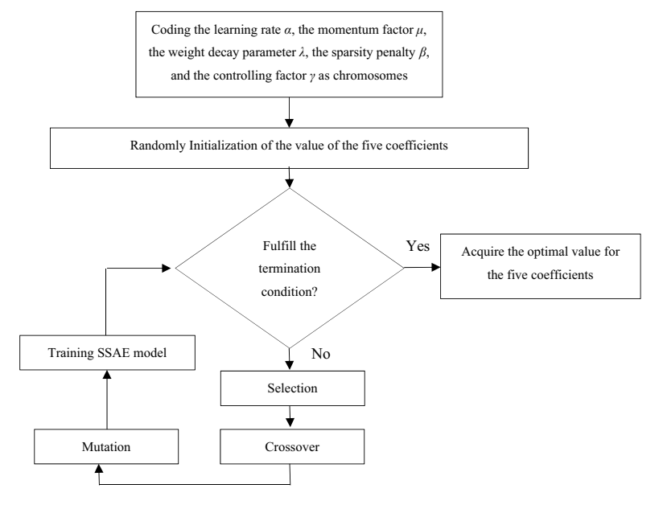
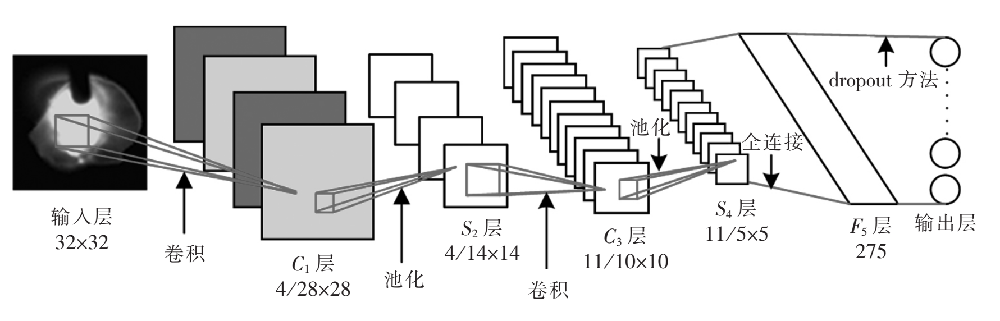

# 神经网络在焊接过程中的应用现状及发展趋势分析

## 摘要

## 1 引言

焊接是一种以加热或加压方式对材料进行接合的工艺及技术。其操作要求严苛，对操作人员有着较高的熟练要求，且工作环境恶劣，操作人员常常处于高危且有毒的环境中，存在着很多的潜在危险[1]。而焊接机器人的应用能大大改善上述问题。它能够提供稳定且均一的焊缝，使得焊缝质量更有保障[2]。同时也大大改善了工业机械操作人员的生活和劳动条件，操作人员只需要方便地装卸工件，就已经可以有效避免操作中接触一些有毒的化学气体和弧光等有害元素。另外，由于焊接机器人可以二十四小时连续生产，因此它的生产效率更高。由此可见，智能化与自动化的生产已经逐渐成为了现代机械焊接加工技术进步与发展的必然趋势。

现代焊接机器人主要根据视觉、电弧、力矩等相关传感器获取焊接环境的相关信息，经过智能化控制与调节来优化自身的焊接轨迹，从而完成复杂的焊接任务[3]。然而近年来焊接机器人的应用飞速增长，同时焊接机器人的应用领域也逐渐趋向复杂多变，焊接控制技术迎来了极大的挑战。由于焊接过程充满了强烈的弧光辐射、焊渣的飞溅、灰尘等不确定因素，还有着高温、氧化等等问题[4]，都会对焊接机器人所接收到的传感器数据产生影响，以至于焊接产生偏差，影响焊缝质量。为了使得焊接机器人能够应对这些问题，焊接机器人必须有比较强的抗干扰能力。

为了使得焊接机器人拥有智能控制能力，机器学习算法必不可少。机器学习算法以推理与学习为核心，涉及了概率论、统计学等多门学科，能够从复杂的数据中学习到知识并将其应用在实际生产中。在机器学习算法中最为突出的方法是神经网络模型，它拥有非常强的自适应能力以及极佳的抗干扰性，这意味它可以在焊接过程中拥有更高的控制精度以及更低的错误率。

随着近年来深度学习技术的发展，神经网络的性能不断提高，在图像处理等等很多领域都取得了突破性的进展，这为焊接机器人的智能化提供了强有力的技术支持。此外，神经网络还在强化学习等方面得到了广泛的应用，这使得焊接机器人能够应对更加复杂的环境，为焊接完全自动化控制奠定了基础。

## 2 神经网络研究现状

神经网络（Neural Network，NN）的相关研究在很早以前就已经出现，而如今已经形成了一个相当大的多学科交叉的学科领域[5]。通常所说的神经网络是指人工神经网络（ANN），是机器学习领域中的一种模仿生物神经网络的结构和功能的数学模型或计算模型。

### 2.1 神经网络基本模型

#### 2.1.1 M-P 神经元模型

生物神经网络最基本的单元是生物神经元（neuron）。生物神经元的基本结构如图 1.1 所示，当一个神经元的电位达到一个阈值时，它会转变为“兴奋”状态，进而向下一个神经元传递神经递质，以影响下一个神经元的电位。生物神经元彼此连接形成网状结构，从而能够完成复杂的功能。

图 2.1 生物神经元结构

1943 年，McCulloch 与 Pitts 将上述情形抽象为一个如图 1.2 所示的简单的数学模型，也就是人工神经网络中最经典的 “M-P 神经元模型”[6]。类似于生物神经元的概念，M-P 神经元接收前驱 $n$ 个神经元的输入信号，并对每个信号赋予一定的权重进行加和，得到 $\sum\limits_{i=1}^n w_i x_i$，将其作为该神经元的信号。当该信号值达到阈值 $\theta$ 时向下一个神经元传递信号，也就是向后一神经元传递信号 $y = f(\sum\limits_{i=1}^n w_i x_i - \theta)$。其中 $f$ 为激活函数，这里使用的是阶跃函数，也即 $f(x) = sgn(x)$。然而由于阶跃函数具有不连续、不光滑等问题，实际应用中常使用 $Sigmoid$ 函数作为激活函数。

图 2.2 M-P 神经元结构

#### 2.1.2 神经网络结构

类似于生物神经网络，将神经元彼此连接便形成了人工神经网络。单层神经网络只包含一个输入层和一个输出层，由于输入层神经元仅接收外界输入而不对数据进行处理，所以输入层往往不计入层数中。单层神经网络的处理能力有限，很难解决线性不可分的问题，所以常见的神经网络一般是两层以上的。两层的神经网络又称为单隐层神经网络（如图 1.3），它包含了一个输入层（input layer）、一个隐藏层（hidden layer）和一个输出层（output layer）。输入层和输出层分别接收外界输入和将输出传输给外界，隐藏层和输出层都有着数据处理的功能。

图 2.3 单隐层神经网络结构

多层神经元相互堆叠形成的深层神经网络对数据有着极强的拟合能力，近年来神经网络层数的极限不断提高，在此基础上发展出来了新的学科——深度学习。深度神经网络通过多层的处理，逐渐将低层特征表示转化为高层特征表示，使得之后用简单模型即可完成复杂的学习任务。近年来深度学习技术不断发展，在计算机视觉、自然语言处理等方面均取得了重大的突破。

#### 2.1.3 其他神经网络模型

M-P 神经元具有简洁且且高效的运算方式，这使得现在大多数神经网络都是基于 M-P 神经元的，深度神经网络也不例外。它们凭借着不同的网络结构，对某一种或一类特定的问题都有着较强的处理能力。比如擅长处理计算机视觉问题的卷积神经网络（Convolutional neural network, CNN）、擅长处理非欧拓扑结构数据的图神经网络（Graph neural network, GNN）、擅长自然语言处理的 Transformer 等等。

除此之外，还有一些神经网络采用了新型的神经元结构。比如神经网络中有一类模型是为网络状态定义一个“能量”（energy），网络的优化目标是最小化这个能量函数。受限玻尔兹曼机（Restricted Boltzmann Machine，RBM）就是这样的一种网络，它常用对比散度算法来进行训练，能够取得不错的性能。近期张绍群、周志华等人参考了生物神经网络中树突浓度会在持续接受刺激后发生一定的变化，将该行为描述为一个二元二值的函数，并将该模型称为 Flexible Transmitter，简称 FT 神经元。FT 神经元具有时序记忆功能，使得其可以处理更加复杂的数据。并使用了复数运算模型巧妙地使神经元的两部分可以协同运算与更新。经测试，该模型在不同任务上均取得了不错的效果，在同等规模的前提下，甚至优于之前最优的神经网络[35]。

<!-- 这里可以加 FT 神经元的图 -->

### 2.2 神经网络的优化方法

由于神经网络的输出结果 $\hat{y}$ 是与预期的输出结果 $y$ 有一定的误差的，这个误差的大小使用误差函数来描述，比如常用的均方误差（Mean Squared Error, MSE）就是计算实际输出与预期输出之间差值的平方和。为了使得神经网络的输出结果更加地精确，需要对神经网络的参数进行优化，常用的神经网络优化算法有误差逆传播算法、遗传算法、模拟退火算法等等。

#### 2.2.1 误差逆传播优化算法

误差逆传播（error BackPropagation，简称 BP）算法是如今最有效且最常用的神经网络优化算法[7]。BP 算法基于梯度下降（gradient descent）策略，以目标的负梯度方向对参数进行调整，对于误差 $E_k$，在一次迭代后参数 $w_{hj}$ 的变化量为 $\Delta w_{hj} = -\eta \frac{\partial E_k}{\partial w_{hj}}$，其中 $\eta$ 为学习率。BP 算法根据误差对各个参数的梯度大小对参数分别调整，使得各个参数能够根据各自的“贡献”调整得恰到好处，提高算法的收敛速度与性能。

最基本的梯度下降法是对整个数据集遍历后计算梯度并进行更新的，这种方法也被称为批量梯度下降法（batch gradient descent, BGD）。由于每次更新都是针对整个数据集，所以不仅计算量大，而且会消耗大量的内存。另外，整个数据集不同数据之间的梯度存在一定的抵消现象，这就使得批量梯度下降法收敛非常慢。另外一种梯度下降法与批量梯度下降法恰恰相反，它每次对一对数据进行更新，这种方法称为随机梯度下降法（Stochastic gradient descent, SGD）。由于每遍历一个数据对就会计算梯度并更新参数，这使得随机梯度下降法对计算设备的性能要求更低，同时也使得网络收敛的更加快速。但由于每对数据都是有一定的随机性的，更新过程中伴随着较大的噪声，所以随机梯度下降并不是每次迭代都向着整体最优化方向，更新的路线会较为曲折。为了综合上述两者的优点，小批量梯度下降法（Mini-batch gradient descent）每次采用一小批数据对网络进行更新，该方法不仅解决了批量梯度下降法收敛慢的问题，又解决了随机梯度下降法噪声多的问题，这也是神经网络更新中最常用的方法。

<!-- 这里可以加 SGD BGD 区别的图 -->

#### 2.2.2 启发式优化算法

BP 优化算法虽然能够非常有效地降低网络误差，但是它只是一种局部搜索算法，在训练过程中非常容易陷入局部最优的位置，导致进一步优化困难等问题。为了跳出局部极小以尽可能地逼近全局最小，人们常采用遗传算法（genetic algorithms, GA）、模拟退火（simulated annealing, SA）算法来逼近全局最优。

图 2.4 网络优化时的全局最小与局部极小

遗传算法（Genetic Algorithm, GA）是模拟达尔文生物进化论的自然选择和遗传学机理的生物进化过程的计算模型，是一种通过模拟自然进化过程搜索最优解的方法。它以个体（individual）为优化对象，以种群（population）为搜索空间，通过选择（selection）、交叉（crossover）与变异（mutation）选取出更优的个体。其本质是一种高效、并行、全局搜索的方法，能在搜索过程中自动获取和积累有关搜索空间的知识，并自适应地控制搜索过程以求得最佳解。

<!-- 这里可以考虑是否详述 GA -->

模拟退火算法（simulated annealing, SA）是对冶金学退火过程进行模拟的算法。它将热力学的理论用在统计学上，将搜寻空间内每一点想像成金属内的原子，将该位置的合适程度作为该原子的能量，而到达相邻位置的概率取决于两点“能量”之差。可以证明，模拟退火算法所得解依概率收敛到全局最优解。

此外，还有一些在 BP 优化的基础上进行优化的算法，比如 Momentum 优化等方法，上述方法都在一定程度上使得网络获得更好的性能，但由于这些技术大多都是启发式算法，理论上尚缺乏保障。

<!-- 这里可以考虑是否详述 Momentum -->

#### 2.2.3 神经网络的优化难点及解决方案

正由于神经网络具有强大的表示能力，神经网络经常遭遇过拟合问题。为了解决该问题，需要使用正则化（regularization）或 Early Stopping 等方案。

在网络训练初期，训练误差与验证误差往往是同时下降的，此时网络学到了比较泛化的表示。随着训练迭代次数的增加，网络可能会将训练集中独有的特征当作所有潜在样本所具有的一般特征，这将会导致网络泛化能力下降，这便是过拟合现象。这在误差上表现为训练误差仍在下降而验证误差不下降或反而上升。为了使得模型学习到最泛化的表示，可以在刚刚发生过拟合时停止网络的训练，这便是 Early Stopping。

另外，网络能够过拟合的主要原因是网络具有极高的拟合能力，如果能够限制网络的拟合能力，那么网络将会更倾向于学习泛化的表示。该方式被称为正则化，常用的正则化方法有 L2 正则化与 dropout。L2 正则化方式通过降低权重的 L2 范数以达到限制模型的拟合能力，提高模型的泛化能力。dropout 在训练过程中随机使某些神经元失活的情况下依然要求神经网络输出预期结果，使得整个网络不过分依赖于任一个神经元，从而减弱过拟合现象[8]。

梯度弥散（vashing gradient）问题是一种在深度神经网络中常见的问题，当使用反向传播方法计算导数的时候，随着网络的深度的增加，反向传播的梯度的梯度值会急剧地减小。由于 BP 神经网络早期使用的激活函数是具有饱和特性的 Sigmoid，其在较小或者较大的输入时导数趋于 0，也就导致了梯度无法传递，参数不能得到更新。

在深度学习崛起的前夕，有两个深度模型突破了限制，达到了更深的网络结构，一个是深度信念网络（deep belief network，DBN）[9]，一个是堆叠自编码器（stacked auto encoder）。两者有着相似的结构与训练方式，前者是由多个受限玻尔兹曼机（Restricted Boltzmann Machine，RBM）相互堆叠后添加一个分类器而成，后者是由多个自编码器（auto encoder，AE）堆叠而成，它们的训练方式都是先进行逐层无监督预训练（pre-training），后使用有监督的微调（fine-tuning）。这种训练方式的有效性主要来源于无监督预训练可以降低网络的方差，起到了一定的正则化效果。另一方面，随机梯度下降的网络训练的早期行为会造成很大的影响，这可能导致后期无论多少次迭代都无法跳出某一个局部最小，而无监督预训练能够将网络参数初始化在一个较好的位置，使其更加接近全局最优[10]。然而该方法并没有解决梯度弥散的问题，所以神经网络的深度仍然非常受限。但该方法确实可以在一定程度上提高模型的精度，而且在拥有大量无标签数据与少量有标签数据的情况下，该方法是更为合适的选择，这种训练方式也被称为半监督学习（Semi-supervised learning）。

为了解决梯度弥散的问题，Xavier Glorot 提出对参数进行合理的初始化以保证前向传播与反向传播时数据的分布不会发生太大改变[11]，随后 Geoffrey Hinton 提出使用 ReLU 作为激活函数[12]，这也是如今最常用的激活函数。但 ReLU 激活函数在负值时仍然没有梯度，会导致神经元死掉，Andrew Maas 提出了 LeakyReLU 激活函数进一步缓和了该问题[13]。但网络更深的时候，梯度弥散就会死灰复燃，何恺明在 ResNet 提出了残差训练的概念，极大地提高了神经网络的深度[14]。

### 2.3 深度神经网络研究及其应用现状

由于神经网络在结构上非常容易堆叠成多层结构，而神经网络的每一层非线性变换都会使得模型的的复杂程度提升，这就使得深层网络有着明显更高的表示能力。因此，提高神经网络深度的极限是近年来神经网络研究的一个热门方向，由此也演变出来了深度学习这一门新的学科。深度神经网络非常适合高维结构化数据的处理，它使得人们不必纠结于高维数据的繁杂处理步骤，只需要定义输入与输出即可获得一个准确的预测模型，神经网络便会自行选用合适的方式对数据进行处理。现如今诸如计算机视觉、自然语言处理等等很多复杂的学习任务都交由深度神经网络来处理，且均取得了重大的突破。

#### 2.3.1 神经网络在计算机视觉的研究与应用现状

神经网络在很早以前就已经应用于计算机视觉任务中了，人们最初尝试的是传统的神经网络，但由于传统神经网络模型并没考虑到图片各个像素点之间的空间关联性，这就使得神经网络拥有过多的参数，同时非常难以训练，很难应用于实际生产中。后来卷积神经网络（Convolutional Neural Network, CNN）的发明与应用彻底改善了这一问题，神经网络不仅在计算机视觉中广泛应用，甚至达到了超越人类水准的分类辨识能力。

1980 年，Kunihiko Fukishima 提出的 Neocognitron[41] 创造性地从人类视觉系统引入了许多新的思想到人工神经网络，被广泛认为是 CNN 的雏形。1990 年，LeCun 将反向传播应用到了类似 Neocoginitro 的网络上来做监督学习[42]。LeCun 的网络结构中引入了权值共享的概念，空间上不同位置的神经元使用同一个卷积核进行卷积。权值共享大大地减少了参数量，也就降低了过拟合的风险，提高了模型的泛化能力，另外也使得训练的速度大大提升。1998 年，LeCun 提出的 LeNet-5[43] 技压群雄，轻松超过其它主流的机器学习算法。但由于当年计算能力的限制和后来 SVM 的大放异彩，CNN 在 21 世纪初迷失了近十年。

图 2.5 LeNet-5 网络结构

LeNet-5 的网络结构已经与现在人们常用的卷积神经网络结构非常相似，它主要主要包含卷积层与池化层。卷积层是对图片上局部像素值进行加权求和，建立一个局部感受野，降低网络参数量。如图 1.5 所示，卷积核扫描过图片时对图片相应位置进行加权求和，将所得值作为输出“图片”相应位置的值，之后通过卷积核不断移动，扫描得到完整的输出“图片”。输出的“图片”称为特征映射（feature map），经过卷积后的 feature map 表示了更复杂的特征[37]。而池化层是对图片进行下采样，降低图片的大小，从而在减少数据量的同时尽可能地保留有用的信息[5]。

图 2.6 卷积层

随着计算机硬件的快速发展，硬件的计算能力不断提升，神经网络的训练逐渐成为了可能。2006 年，研究人员成功利用 GPU 加速了 CNN，相比 CPU 实现快了近四倍。2012 年，AlexNet[44] 在 ImageNet 大规模识别挑战赛（ImageNet Large Scale Visual Recognition Competition，ILSVRC）图片分类任务上以 15.3% 的 Top-5 错误率登顶，远高于第二名的 26.2%。AlexNet 基本结构参考了 LeNet-5，同时为了防止梯度弥散（vashing gradient）等问题使用了 ReLU 激活函数[12]。AlexNet 使得 CNN 再度被人们所重视，也标志着神经网络的复苏与深度学习的崛起。

随后几年，CNN 迎来了快速发展的浪潮，新的网络结构层出不穷，效果也在不断提升。2014 年，google 提出的 GoogleNet[45] 和 Visual Geometry Group 提出的 Vgg[46] 分别在 ILSVRC2014 位列第一和第二。后者在 AlexNet 的基础上进一步提高网络深度，前者则在网络结构上另辟蹊径，不仅能够提高网络深度，而且大大减少网络参数量。2015 年，何恺明提出的 ResNet 利用残差结构使得网络能在不退化的前提下提升到 152 层[14]，一举摘得 ILSVRC2015 桂冠。此后几年，google 在 GoogLeNet 提出的 Inception 结构和何恺明提出的 ResNet 成为了 CNN 两个主要发展的方向。google 在 Inception 结构的基础上提出了 InceptionV2、InceptionV3、Xception、InceptionV4、Inception-ResNet、Inception-ResNetV2 结构，不断提升网络的性能，后两者融合了 ResNet 的残差结构，使得网络性能进一步提升。何恺明也相继提出了 ResNetV2、ResNeXt，后者也在结构中借鉴了 Inception 结构。2017 年，GaoHuang 提出的 DenseNet 结构建立了比 ResNet 更加密集的连接，并提出了特征重用的概念，不仅能够解决梯度弥散等问题，还进一步减少了参数量[47]。同年，Jie Hu 提出的 SE-Net 利用通道注意力机制进一步优化 ResNeXt 结构[48]，一举夺得 ILSVRC2017 同时也是最后一届 ILSVRC 的桂冠。

神经网络的研究极大地推动了计算机视觉的发展，它使得原来很多不可能的任务成为了现实，如今神经网络已经在很多任务上达到甚至超越人类的表现，这让我们看到了深度学习研究的无限可能。

#### 2.3.2 深度强化学习研究与应用现状

强化学习（Reinforcement learning, RL）是机器学习和人工智能的一个分支，专注于目标导向的学习和决策。强化学习不同于传统有监督的机器学习任务，在最开始是没有可供训练的数据的，而数据的获取是通过机器与环境之间的交互逐渐获得的。在与问题或环境的持续互动中，强化学习智能体采取行动并观察所得的奖励，智能体根据这些观察结果来改变其选择动作的方式，以达到学习的效果。简而言之，监督学习就是教书式的学习，而强化学习则是在实践中进行摸索式的学习。

强化学习主要分为基于模型（model-based）、基于值（value-based）、基于策略（policy-based）三种学习方式。基于模型的学习方法是让智能体自己学习出来一个能够从它的观察角度描述环境是如何工作的模型，然后利用这个模型来进行动作的规划。也就是说基于模型的方法需要对环境进行建模，建模的好坏则直接影响了最终决策的优劣。然而事实上很多情况并不需要对环境进行建模就可以找到最优的策略，基于值的学习方式与基于策略的学习方式就是最好的证明。基于值的学习方式是让智能体能够更加准确地进行自我评价，智能体可以在采取行动之前就意识到自己改行动的好坏，进而及时调整行为。基于策略的学习方式则是直接让智能体学习在某一环境下自己应当采取何种行为。这三种方式并非完全割裂的，事实上模型、值与策略刚好是强化学习智能体的三个重要组成部分，而三种不同的学习方式只是学习的关注点不同而已。

最近几年强化学习的常用方法也在逐渐转变，过去常用的方法是基于模型的学习方法，而近期的研究中已经很少使用该方法，更多使用的是基于值与基于策略的学习方法。自 12 年 Actor-Critic 算法[52]被提出，研究的热点也转向了基于值与基于策略相结合的方法。此后，2013 DeepMind 提出 A3C 算法，通过多线程异步训练的方法解决了数据时间相关性的问题，使得 Actor-Critic 网络训练更加容易[53]。

图 2.7 强化学习系统结构图

近年来深度学习的崛起也是极大地推动了强化学习的研究，强化学习的研究重心也在逐渐向深度强化学习转变。13 年 Volodymyr Mnih 等人提出的 Deep Q-Network 成功地将深度学习方法应用在基于值的学习方法 Q-learning 上，被人们认为是深度强化学习的开山鼻祖[49]。15 年到 16 年 DeepMind 推出的 AlphaGo 先后击败了欧洲围棋冠军华裔法籍职业棋手樊麾二段与世界冠军韩国职业棋手李世石九段，这使得人们真正地意识到人工智能的能力，AlphaGo 也被誉为人工智能研究的标志性进展。AlphaGo 采用蒙特卡洛树搜索与深度神经网络相结合，其中神经网络的训练一方面使用了人类棋谱来进行监督训练，另一方面采用了基于模型、基于值与基于策略三种方法相结合的强化学习方法[50]。此后，DeepMind 再次推出 AlphaGo Zero，抛弃从人类棋谱中进行监督学习的方法，而是从零开始，不断进行自我对弈，这使得学习速度大大提升，仅仅 40 天就超过之前所有版本的水平[51]。

深度强化学习最近今年在不同领域大显神通，比如在视频游戏、棋类游戏上打败人类顶尖高手，控制复杂的机械进行操作，调配网络资源，为数据中心大幅节能，甚至对机器学习算法自动调参。各大高校和企业纷纷参与其中，提出了眼花缭乱的 DRL 算法和应用。DeepMind 负责 AlphaGo 项目的研究员 David Silver 甚至喊出认为结合了 DL 的表示能力与 RL 的推理能力的 DRL 将会是人工智能的终极答案。然而强化学习仍然是具有非常多的局限性的，比如样本利用率非常低，好的奖励函数难以设计，难以平衡“探索”和“利用”，对环境的过拟合等等问题，这些问题严重地阻碍了深度强化学习的发展，因此这些问题将会是深度强化学习今后的研究重点。

## 3 神经网络在焊接领域的应用研究现状

智能化是当今焊接领域的重要发展方向，而如今人工智能也是正值发展的上升期，各种模型层出不穷，在很多任务上都取得了重大的突破。焊接领域的很多任务也都开始应用新的智能技术，由于神经网络是一种非常有效的机器学习算法，它拥有非常强大的学习能力，可以轻松从数据集中发现潜在规律，将神经网络应用于焊接领域中的焊接工艺参数选择与优化、焊缝跟踪、焊接缺陷预测、力学性能预测等都具有比较理想的效果[18]。

### 3.1 机器学习算法在焊接领域的研究现状

机器学习是人工智能的一个分支，涉及概率论、统计学、逼近论、凸分析、计算复杂性理论等多门学科。机器学习理论主要是设计和分析一些让计算机可以自动“学习”的算法。机器学习算法是一类从数据中自动分析获得规律，并利用规律对未知数据进行预测的算法。算法设计方面，机器学习理论关注可以实现的，行之有效的学习算法。很多推论问题属于无程序可循难度，所以部分的机器学习研究是开发容易处理的近似算法。机器学习中的算法繁多，常用的算法主要是决策树（decision tree）、支持向量机、神经网络、k 近邻（k-nearest neighbor，k-NN）算法，这些算法现如今已经广泛用于焊接预测与控制等应用之中，为焊接过程提供了强有力的技术保证。

图 3.1 机器学习的基本流程

支持向量机可以在高维空间中构造超平面以最大程度地将两类数据分离，支持向量机会最大化两类数据相对于这个超平面之间的距离，这个距离被称为间隔（margin），因此这种线性分类器也常被成为最大间隔分类器[29]。然而这种线性分类器无法对非线性数据进行划分，所以需要在其基础上应用一个核函数，使 SVM 具有非线性分类的能力。由于 SVM 相比于 logitic 回归拥有更加简单的数学表示形式，所以 SVM 在小型的分类任务上往往会有着更好的效果和训练速度。顾盛勇在焊缝视觉检测系统中使用了 SVM 预测焊缝位置，并利用 PCA 算法进行优化[30]。贺峰等人基于多传感器和 SVM 对焊接过程进行模式识别，有效地提高了焊接过程准确率[31]。

随机森林算法也是一种机器学习任务中的常用方法。随机森林算法是一个包含多个决策树的分类器，并且其输出的类别是由个别树输出的类别的众数而定。它对多种数据都能较好地进行分类，但是在类别特别多时它的表现并不会太好。Zhifen Zhang 等人首先使用 PCA 算法对数据进行降维处理，之后使用 RF 进行分类，有效地对焊缝缺陷种类进行预测[32]。Haixing Zhu 等人首先利用 CNN 对熔池图片进行降维，之后使用 RF 进行了有效的分类[33]。

### 3.2 神经网络在焊接结构分析中的应用现状

焊接接头的结构能够直接影响焊接件的性能，间接地反映了焊接质量，因此如果能够根据焊接时所使用的工艺参数来对焊接熔宽进行预测，那么就能实时判断焊接质量，进而调整焊接参数以达到焊接过程的监控。但由于焊接过程涉及多种复杂因素，很难人工推导出对焊接结果的预测公式，因此常需要机器学习技术对已有数据进行拟合，获得较为准确的预测模型。其中最有效的方法是神经网络，它在非线性、多变量复杂的预测问题都取得了比较好的效果[54]。

#### 3.2.1 神经网络焊接接头结构分析研究

传统的 BP 神经网络在焊接预测中已经有着广泛的应用，均取得了不错的效果。赵成涛建立了基于 BP 神经网络的镁合金焊缝成形预测模型，利用神经网络的映射能力和分析能力，采用焊接过程的焊接电流、焊接电压、焊接速度、焊丝干伸长作为预测输入，把焊缝成形中的焊缝熔深、熔宽、余高作为信息输出对神经网络进行训练，从而建立基于 BP 神经网络的焊接参数和焊缝成形的映射模型[20]。黄军芬等人利用 BP 神经网络建立了熔池形貌与背面熔宽的模型，对熔透情况进行了预测[21]。Limeng Yin 等人利用双隐层神经网络对焊缝尺寸进行了预测，在网络的设计细节中使用了较新的深度学习技术，取得了较高的预测精度[22]。

虽然传统的 BP 神经网络已经能够取得不错的效果，但由于其本质是一种局部搜索方法，很容易陷入局部最优，使得网络泛化能力下降。遗传算法起源于对生物系统所进行的计算机模拟研究。它是模仿自然界生物进化机制发展起来的随机全局搜索和优化方法，借鉴了达尔文的进化论和孟德尔的遗传学说。Bowen Liu 搭建神经网络来拟合焊接参数与焊接缺陷的映射关系，并使用遗传算法进行优化，并进一步搜索焊接缺陷最低时对应的焊接参数，最终焊接成品有着较好的质量[23]。

遗传算法不仅可以独立使用，还可以结合 BP 算法进一步提高模型的精度，其方法是首先利用遗传算法优化神经网络参数达到一个较优的效果，然后以此为 BP 优化的起点，使用梯度下降法进一步训练以降低误差。该方法被称为 BP-GA 方法，它结合了 GA 和 BP 的优点，首先在全局范围内为 BP 设置了一个比较好的起点，使得之后的 BP 优化能够更加接近全局最优。张喆等人利用 BP-GA 的方法拟合了焊接前进方向温度预测模型和前进侧方向温度预测模型，其预测能力要优于基于传统 BP 神经网络所建立的模型[24]。Hua Ding 等人利用 BP-GA 算法对焊接残余厚度进行了预测，使得网络的预测精度更加准确，收敛速度大大提高[26]。

图 3.2 BP-GA 神经网络权值阈值优化流程

此外，无监督预训练也能够显著提高神经网络的性能。稀疏自编码器（sparse auto encoder，SAE）是自编码器的一种变体，它对参数添加了一个惩罚项，使得被激活的神经元限制数量限制在一个较低的值，换言之，网络会学习到较为稀疏的表示，而稀疏的表示能够在编码时更加有效地对数据进行降维。堆叠稀疏自编码器（stacked sparse auto encoder，SSAE）是由稀疏自编码器堆叠而成的，它相比于堆叠自编码器拥有更好的降维效果，可以学习到更有用的特征。Yanxi Zhang 等人利用 SSAE 对焊接状态进行预测，之后使用 GA 进行超参数搜索，取得了一定的效果，并将该方法称为 SSAE-GA 方法[27]。

图 3.3 SSAE-GA 对神经网络的优化流程

与 SAE 相似，还有一种相似的自编码器被称为降噪自编码器（denoising auto encoder），堆叠后的结构即 SDAE，SDAE 能够从包含噪声的数据中还原数据，因此有着更强的鲁棒性。Johannes Gunther 等人在图像特征提取过程中使用了 SDAE，并使用提取出的特征进行了 SVM 分类测试，仅产生了较低的分类误差。这些提取出的特征用于后续焊接控制神经网络的输入，取得了较好的控制效果[28]。

<!-- 考虑加不加焊接缺陷预测（3.2.2） -->

#### 3.2.2 卷积神经网络熔池特征提取研究

焊接接头的性能直接受焊缝质量影响，而焊缝质量又直接受焊接时熔池影响，因此熔池形貌信息能够辅助焊接接头结构预测以及焊接性能预测。由于熔池信息往往只能通过图片采集的方式获得，而从图片中获得重要的熔池形貌信息往往需要图片处理技术，常用的熔池形貌提取技术有阈值分割、边缘检测算子、数学形态学方式。由于这些方法往往效果并不是很好，而且处理过程较为繁琐，因此该任务可以采用神经网络来完成。

图像处理所使用的神经网络主要是卷积神经网络，卷积神经网络中的特征提取和模式分类同时进行，对图像的位移、缩放、倾斜及其它形式的扭曲变形都具有良好的不变性和等变性[36]。而且卷积神经网络有着很强的学习能力与自适应能力，相对于传统的边缘提取技术，它拥有更高的鲁棒性与更快的处理速度。

深度学习的多层堆叠、每层对上一层的处理机制可以看作对输入信号进行逐层加工，从而把初始的输入表示一步步转化为与输入目标更为密切的表示，由此可将深度学习理解为特征学习[5]。较低的层次处理一些简单的诸如边缘、形状、颜色之类的特征，而在高层，低层特征组合出来更为复杂的对象特征，诸如眼睛、嘴、耳朵等等[37]。因此即便输出结果有所不同，神经网络在前几层也会做几乎相同的特征提取任务。

近几年有很多利用卷积神经网络进行熔透预测的相关研究，其本质上也是低层网络从熔池图像中提取出有用的特征，交由高层预测模块进行预测。李海超等人使用卷积神经网络对熔透状态进行了预测，并对卷积层的特征映射进行了可视化，对熔透预测模型的依据进行了一定的解释。刘新锋利用基于 ImageNet 预训练的 AlexNet，对穿孔状态及熔透状态进行预测，取得了较高的准确率[38]。

也有一些研究使用卷积神经网络直接将熔池图像特征进行压缩，提取出较低维度的特征信息，作为后续预测步骤的一部分信息。覃科等人利用卷积神经网络对熔池特征进行提取，交由后续支持向量机（support vector machine，SVM）分类器进行分类预测，两者同步训练，以预测焊接熔池的状态信息。他们同时还使用了传统的 BP 神经网络直接进行预测，对比结果显示卷积神经网络明显有着更高的准确率和鲁棒性[39]。Haixing Zhu 等人利用卷积神经网络对焊缝表面图像进行特征提取，交由后续随机森林（Random Forest，RF）算法进行分类，优于直接在 CNN 后接 Softmax 分类层的效果[40]。

图 3.4 熔池状态识别的卷积神经网络结构

### 3.3 神经网络在焊接性能预测的应用现状

焊接的性能直接反映了焊接的质量，如果能根据焊接时的焊接工艺参数等焊接实时信息对焊接性能进行预测，能够更有针对性地提出优化焊接过程参数以及相应的控制方法，也就达到了焊接的在线监控的效果。张永志等人利用广义动态模糊神经网络来对不同厚度、不同工艺条件下的 TC4 钛合金 TIG 抗拉强度、抗弯强度、焊缝硬度、热影响区等力学性能进行较为准确的预测[55]。刘政军等人提出利用双重人工神经网络来对 7075 高强度铝合金焊接强度系数进行预测，该模型能够较好地对焊接工艺参数、接头力学性能与显微组织结构之间的关系进行拟合，最终计算结果与物理测试数据基本一致[56]。刘立鹏等人利用 BP-GA 算法优化神经网络，对焊接接头力学性能进行预测，并达到了预期的精度要求[25]。张昭等人在搅拌摩擦焊过程中使用 BP 神经网络成功地通过搅拌头旋转速度、焊接速度、距离焊接中心距离等参数预测了焊接接头硬度，且测试结果表明 BP 人工神经网络能够很好地预测接头硬度，为焊接接头力学性能预测提供了新方法[59]。

另一方面，如果通过焊接后测量的焊缝尺寸参数来预测焊缝性能虽然无法直接对焊接参数进行调整，但它可以作为一个预测模块来使用，在前驱预测模块通过焊接工艺参数预测得到焊接接头结构时，进一步通过该模块获得焊接性能，以辅助更加精确地反向参数调控。同时，这也对焊接性能研究起到了重要的作用。阮德重等人考虑到时效强化后焊接接头的抗拉强度与焊缝的形状密切相关[57]，尝试通过焊缝形状参数来预测和控制接头的力学性能，使用了 RBF 神经网络对接头焊缝形状与其对应的焊接接头的抗拉强度等参数进行预测，精度大幅提高[58]。

### 3.4 神经网络在焊接工艺控制中的应用现状

焊接的工艺控制目标是获得较好的焊缝质量，一方面可以通过焊接接头的力学性能能够直接反映焊缝质量，另一方面可以通过焊缝的尺寸来间接反映焊缝质量，而这两者我们可以通过焊缝结构分析与焊缝性能预测获得。因此，一种简单的控制方式就是，在焊接机器人的工作过程中引入实时地预测焊接质量，并搜索到最佳质量所对应的焊接参数，并进行焊接。这一方面已经有很多相关研究，而且前面所述的结构分析与性能预测算法也可以直接应用。张抱日等人利用 BP 神经网络建立了焊接高度与电弧电压的对应关系模型，并进一步实现了焊接高度的自动控制[19]。

焊接的完全自动化需要焊接机器人自行跟踪焊缝并进行精准地焊接，而在这个过程中，焊接偏差的大小也会直接决定着焊接质量的高低。由于焊接是一个高度自由的动态过程，机器人动力学结构上高度相关与耦合，难以直接建立精确的机械臂动力学模型，另一方面焊接过程存在大量的不确定的扰动，这些都会对焊接控制产生不可忽略的误差，因此焊接过程的动力学控制也是一个重要的研究课题。

#### 3.4.1 神经网络在焊缝跟踪过程的应用

焊接的动力学控制的关键是使得机器人能够对焊缝进行跟踪，这需要通过传感器获得视觉等信号来引导机器人姿势来自动调整焊缝的位置，然后从起始点开始实现焊缝自动跟踪的控制。其中所使用的传感信号包含了焊接过程中的焊炬与坡口图像信号以及焊接过程所产生的光、热、电、磁、声等物理信号。这些信号通过图像处理技术以及控制算法的处理得到焊缝的中心位置以及焊枪的调整方向。

图 3.5 焊接机器人焊缝自动跟踪系统框图

由于焊接的偏差会极大地影响焊缝质量，而焊接过程中影响因素众多，传统的 PID 控制很难实现焊缝跟踪的自动化控制，因此焊缝跟踪过程也需要神经网络等机器学习技术的辅助。陈皓等人针对焊缝跟踪过程中姿态的规划与调整的问题，以移动焊接机器人本体与焊枪为研究对象，在构建轮式移动焊接机器人的本体运动学模型基础上，考虑到了滑块滑长与焊枪长度等制约因素，以优化跟踪精度与速度为目标，建立了焊缝跟踪多目标优化模型，根据焊缝跟踪问题特征，设计了遗传算法，定义了编码结构，产生初始种群，构建了适应度函数。通过 MATLAB 进行仿真验证，并与 BP 神经网络进行对比，仿真结构表明该方法在加快焊缝跟踪速度、提高焊接精度方面的有效性[60]。刘建昌等人考虑机械臂动力学模型非线性和参数的不确定性，采用神经网络来对跟踪误差进行补偿，对机械臂进行跟踪控制，进一步提高了机器人的控制精度[61]。张文辉等人提出一种神经网络与变结构融合的机器人控制策略，由于局部泛化网络的不足，相应地对三个区域分别采用该算法的分级与集成控制，并理论证明了控制系统的全局稳定性[62]。王保民等人考虑到此前的控制算法大多是基于关节空间的轨迹跟踪控制算法，这种控制算法反馈信号都是猜忌关节角为之而不是末端轨迹，这就无法形成闭环控制，从而造成即使关节角误差很小却依旧受到机械臂长度的影响，针对以上情况，利用焊枪末端轨迹与速度作为反馈信号，并采用 RBF 神经网络在新学习来补偿建模误差，提出了基于 HJI 定理的笛卡尔空间轨迹跟踪控制算法[63]。

图 3.6 串联焊接工业机器人

#### 3.4.2 深度强化学习在焊接控制中的应用

现阶段传统的机器人控制算法大多使用的是传统的路径规划算法，但这些算法只能应用在特定的某些场景，缺乏灵活性，而且需要对环境进行精确的建模，在复杂的工业环境下并不能很好地适用。强化学习能够在与环境的交互过程中进行学习，已经在机器人的控制过程中得到应用广泛。因此，如果将强化学习应用在焊接机器人的控制过程中将会取得更佳的控制效果，降低算法的复杂度与错误率。

Q-learning 是一种常见的基于值的强化学习算法，但该算法需要将所有状态、行为以及对应的值列在一张表上，而焊接环境对应着无数的状态与行为，不仅难以枚举，而且会占用大量的内存空间。DQN 是 Q-learning 的改进版本，它使用神经网络替代了 Q-learning 中的表格，使得该算法在复杂的环境中也可以使用。李广创等人在 DQN 中使用三层的神经网络，将机械臂作为输入的状态信息，机械臂的运动关节角度作为输出的控制信号，通过离线训练使得机械臂能够自行找到一跳接近于最优的运动轨迹，能够成功地避开障碍物到达目标点[64]。

Q-learning 在网络更新的时候采用了 off-policy 的策略，它在计算下一状态的预期收益时选取最优的行为，而当前策略与学习时的策略不同，因此实际并不一定采取最优的行为。为了改进该问题，Sarsa(State-Action-Reward-State-Action）采用 on-policy 策略对网络进行更新，在当前的 policy 直接执行一次行为的选择，然后用这个样本来更新策略，因此生成的样本的策略和学习时的策略相同，该方法直接了当，更容易使用。刘卫朋针对焊接两自由度机械臂的控制问题，提出一种基于 SARSA 的机械臂轨迹跟踪控制策略,与传统 PD 控制组合使用，利用 PD 控制完成基本的镇定任务，利用强化学习算法实现对未知干扰因素的补偿，提供对不同情况的适应能力。仿真实验表明在引入增强学习的方法后，机械臂可实现自主控制。控制器在连续的空间内产生实值型的控制量，提高了控制精度。另外，通过仿真试验验证了自适应离散化的强化学习方法在机械臂轨迹跟踪问题中的可行性和有效性，明显地提高了控制器的学习速度[65]。

图 3.7 基于 SARSA 的机械臂轨迹跟踪控制系统方案

Actor-Critic 算法是一种基于策略与基于值训练方式相结合的强化学习算法，它采用一个 Actor 来学习用来生成行为的策略，以及一个 Critic 来评估算法的性能，以降低对学习算法更新时的方差。Actor 与 Critic 的协同工作使得算法能够有效的进行，同时两者相互促进，使得有着更高的准确率。Johannes Gunther 等人在焊接过程中使用 Actor-Critic 算法结合 Nexting 算法来实时控制焊接的功率，并并使用激光焊接模拟器进行了多次初步控制演示[28]。

此外还有些研究提出了一些新的控制算法。芦川考虑到 DQN、Sarsa 等算法主要作用于离散型输出场景，并不能直接应用于文本所研究的连续环角焊缝的焊接作业，提出一种基于传统轨迹规划经验库和奖励逼近的轨迹规划方法 B-DPPO，首次将分布式近似策略优化 DPPO 运用于锅筒未知环角焊缝焊接中。并利用传统轨迹规划经验库，减少 B-DPPO 策略的无效探索，增强策略的学习效率。同时，为实现全位置焊缝不同位置焊缝成形优良采用近似策略优化将对流管与机器人空间位置和相对方向纳入一种新型方位奖励函数中，减少无谓探索计算[66]。

## 4 神经网络在焊接领域应用研究的发展趋势

<!-- 趋势嘛，就是深度学习 + 强化学习 -->

### 4.1
### 4.2
## 结论

# Refs

1. 王田苗. 我国工业机器人技术现状与产业化发展战略
2. 邱葭菲. TIG 打底焊工艺研究
3. 霍厚志. 我国焊接机器人应用现状与技术发展趋势
4. 孟宪伟. 焊接智能化的研究现状及应用
5. 周志华. 机器学习
6. M-P 神经元论文
7. BP 论文
8. dropout2012
9. 无监督优化 RBM 论文 2006
10. Dumitru Erhan. Why Does Unsupervised Pre-training Help Deep Learning?
11. Xavier Glorot 初始化
12. ReLU 的论文
13. Leaky ReLU
14. ResNet
15. 张景奇. 机器学习在医疗和公共卫生中应用
16. 互联网医疗健康产业联盟. 2018 年医疗人工智能技术与应用白皮书[R]. 2018.
17. Butler K T,Davies D W,Cartwright H,et al. Machine learning for molecular and materials science[J]. Nature,2018,559(7715).
18. 裴浩东．人工神经网络及其在焊接中的应用
19. 张抱日. 基于焊缝熔透检测的机器人深熔 K-TIG 焊接系统
20. 赵成涛. 基于 BP 神经网络的镁合金焊缝成形预测
21. 黄军芬. 基于视觉传感的 GMAW 熔透状态预测
22. Limeng Yin. Prediction of weld formation in 5083 aluminum alloy by twin-wire CMT welding based on deep learning
23. Bowen Liu. Optimal design for dual laser beam butt welding process parameter using artificial neural networks and genetic algorithm for SUS316L austenitic stainless steel
24. 张喆. 基于遗传 BP 神经网络的搅拌摩擦焊温度模型
25. 刘立鹏. 基于遗传神经网络的焊接接头力学性能预测系统
26. Hua Ding. Research on laser processing technology of instrument panel implicit weakening line based on neural network and genetic algorithm
27. Yanxi Zhang. Real‑time monitoring of high‑power disk laser welding statuses based on deep learning framework
28. Johannes Gunther. Intelligent Laser Welding through Representation, Prediction, and Control Learning: An Architecture with Deep Neural Networks and Reinforcement Learning
29. 统计学习方法. 李航
30. 顾盛勇. 基于视觉传感的高效深熔锁孔TIG焊焊缝识别及熔透状态的研究
31. 贺峰. 基于多传感器和支持向量机的 GMAW 焊接过程模式识别研究
32. Zhifen Zhang. Real-time seam defect identification for Al alloys in robotic arc welding using optical spectroscopy and integrating learning mechanisms in 20kw-class CO2 laser welding processes[J]. Journal of Physics D:Applied Physics, 2002, 36(2): 192.
33. Haixing Zhu. Deep Learning-Based Classification of Weld Surface Defects
34. Matthew D. Zeiler. Visualizing and Understanding Convolutional Networks
35. Flexible Transmitter Network
36. Krizhevsky A，Sutskever I，Hinton GE. ImageNet classification with deep convolutional neural networks[C]. Advances in Neural Information Processing Systems, Curran Associates RedHook,NY,USA,2012:1097-1105．
37. Matthew D. Zeiler. Visualizing and Understanding Convolutional Networks
38. 刘新锋. 基于正面熔池图像和深度学习算法的PAW穿孔/熔透状态预测
39. 覃科. 基于卷积神经网络的CO2 焊接熔池图像状态识别方法
40. Haixing Zhu. Deep Learning-Based Classification of Weld Surface Defects
41. Fukushima. Neocognitron
42. LeCun. Handwritten digit recognition with a back-propagation network
43. LeCun. Gradient-Based Learning Applied to Document Recognition
44. ImageNet Classification with Deep Convolutional Neural Networks
45. GoogLeNet 的论文
46. vgg 的论文
47. DenseNet
48. SE-Net
49. DQN 论文
50. AlphaGo 论文（没下）
51. AlphoGo Zero 论文（没下）
52. Actor-Critic
53. A3C 算法
54. Shojaeefard M H,Behnagh R A,Akbari M,et al. Modeling and pareto optimization of mechanical properties of friction stir welded AA7075 / AA5083 butt joints using neural network and particle swarm algorithm[J]. Materials & Design, 2013, 44(2):190198.
55. 张永志. 广义动态模糊神经网络焊接接头力学性能预测
56. 刘政军. 人工神经网络模型预测焊接接头强度系数的研究
57. Dengkui Zhang, Guoqing Wang, Aiping Wu, et al. Study on the inconsistency in mechanical properties of 2219 aluminium alloy TIG-welded joints[J]. Journal of Alloys and Compounds,2019,777: 1044-1053.
58. 阮德重. 基于 RBF 神经网络预测 2219 铝合金多层 TIG 焊接头拉伸性能研究
59. 张昭. 基于大数据驱动的焊接接头力学性能预测
60. 陈皓,堵俊,葛佳盛等.一类多目标焊缝跟踪优化模型和算法[J]. 制造业自动化, 2015, 37(8):1-3.
61. 刘建昌,苗宇. 基于神经网络补偿的机械臂轨迹控制策略的研究 [J].控制与决策,2005,20(7):732-736.
62. 张文辉,齐乃明,尹洪亮. 自 适 应 神经 变 结构的机 器人轨迹跟踪控制[J ].控制与决策, 2011,26(4):597-600.
63. 王保民. 基于 RBF 神经网络的弧焊机器人轨迹跟踪控制方法
64. 李广创. 基于深度强化学习的机械臂避障路径规划研究
65. 刘卫朋. 焊接机器人焊接路径识别与自主控制方法研究及应用
66. 芦川. 锅炉内壁管板焊接跟踪智能焊接机器人机构设计与运动控制
67.
